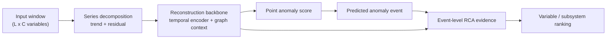

# LaGraph Current Architecture

Date: 2026-06-17  
Scope: current paper-facing architecture and active RCA research boundary.

## One-Sentence Positioning

LaGraph is currently a reconstruction-based multivariate time-series anomaly
diagnosis framework. Its main paper value is not generic detector SOTA, but
predicted-event root-cause ranking: after an anomaly event is detected, the
system ranks likely source variables using residual, onset, mechanism-context,
source-gate, and event-specific evidence.

## Current Main Line

The stable reporting baseline is:

```text
source-bottleneck-specificity-rca
```

The latest experimental candidate is:

```text
source-bottleneck-consistency-rca
```

The candidate should not be called final until WADI/SWaT results are confirmed
under the same predicted-event RCA protocol.

## Data Flow



The model first learns normal reconstruction behavior. During inference, it
turns reconstruction errors into anomaly scores and predicted events. RCA is
then computed inside each predicted event, not inside oracle ground-truth
windows.

## Main Components

| Component | Current role | Paper claim boundary |
|---|---|---|
| Reconstruction backbone | Learns normal multivariate temporal behavior | Supports anomaly scoring; not claimed as universal SOTA detector |
| Channel mechanism graph | Provides neighbor/context evidence among variables | Mechanism/dependency graph, not strict causal graph |
| Temporal evidence | Captures event timing and onset behavior | Helps separate early source evidence from later propagated response |
| Source bottleneck | Encourages a small set of variables to explain event source evidence | Main RCA narrative: source variables should not be confused with high-response variables |
| Event specificity | Suppresses variables that are generically high-scoring across many events | Reduces common response-variable domination |
| Hierarchical RCA | Reports both subsystem-level and variable-level rankings | Useful for industrial diagnosis and reviewer-facing interpretability |

## RCA Score View

For a predicted event, each variable receives a combined score from several
evidence terms:

```text
RCA score =
    local residual evidence
  + onset/source evidence
  + mechanism-context deviation
  + source-gate evidence
  - propagated-response penalty
  - generic event-response penalty
```

The exact weights are controlled by the selected profile. The important paper
point is the decomposition of evidence, not claiming that every term is always
positive on every dataset.

## Mechanism Graph Meaning

The graph should be described as a learned mechanism/dependency context:

```text
If a variable cannot be well explained by its normal mechanism neighbors during
an event, it may be part of the abnormal source or propagation path.
```

It should not be described as a fully supervised causal graph. Current evidence
supports graph-guided source ranking, not causal discovery.

## Active Profiles

| Profile | Status | Purpose |
|---|---|---|
| `source-bottleneck-specificity-rca` | stable baseline | Main current reported model |
| `source-bottleneck-consistency-rca` | under validation | Adds source-effect consistency supervision and source-interaction evidence |
| `source-bottleneck-root-response-*` | experimental | Tests root/response separation heads |
| `source-bottleneck-evidence-fusion-*` | experimental | Tests stronger evidence fusion and top-k reranking variants |
| `source-bottleneck-no-mechanism-rca` | ablation/control | Tests whether mechanism graph helps or hurts |
| `source-preserving-*` | rejected/weak candidate | Weakening mechanism injection did not reliably improve SWaT |

## Main Datasets

| Dataset | Current role |
|---|---|
| WADI A1 ds10 | Main variable-level RCA benchmark |
| SWaT A1/A2 Physical | Main variable-level RCA benchmark |
| HAI | Coarse/subsystem-level supplementary evidence |
| MSDS | Candidate future generalization dataset; requires preprocessing and label construction |

MSL and SMD are not current main RCA datasets.

## Evaluation Protocol

The primary RCA protocol is:

```text
predicted-event variable-level RCA
prediction_key = 15
metrics = MRR, Hit@1, Hit@3, Hit@5, PR@K, MAP@K
```

Detection metrics remain necessary, but they are not the main paper claim. The
paper should report enough detection quality to show that predicted events are
usable, then focus on whether the root-cause ranking is better than simple
baselines under the same predicted-event protocol.

## What Not To Claim

Do not claim:

- universal anomaly detection SOTA;
- fully causal graph discovery;
- that every graph module improves every dataset;
- that post-hoc reranking alone is the core contribution;
- that HAI subsystem-level results prove variable-level RCA.

## Current Documentation Policy

This file is the current architecture source of truth. Historical architecture
notes have been moved to:

```text
D:\la_v12\docs\archive\2026-06-17\
```

Detailed experiment logs remain under:

```text
D:\la_v12\result\analysis\
```

Those logs are lab records, not current system descriptions.
