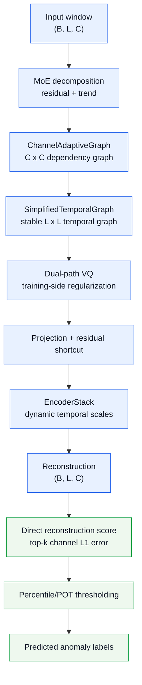

# LaGraph Architecture

Date: 2026-05-24
Branch: `codex/5070-env-migration`
Runtime target: RTX 5070 single GPU

## Positioning

LaGraph is currently a compact reconstruction-based multivariate time-series
anomaly detector. The stable main profile is `full`, which keeps the dual-graph
representation, VQ regularization, dynamic temporal encoding, and direct
reconstruction anomaly scoring.

The current system should not be described as a large module-stacking method.
Several earlier modules have been removed or moved to ablation-only status
because recent experiments did not support them as reliable contributors.

The strongest current paper direction is:

- efficient dual-graph representation learning;
- interpretable channel and temporal dependency structures;
- VQ-regularized normal-pattern representation;
- transparent negative ablations showing why unused modules were removed;
- optional future extension toward explicit causal structure learning.

Large metric gains are still possible, but they are unlikely to come from adding
more generic blocks. The best remaining opportunities are causal/structural graph
learning and score calibration. Until those are implemented and validated, the
paper should emphasize interpretability, efficiency, and stability rather than
claiming a universal metric lead.

## Main Profile

The default profile for reporting is `full`.

| Component | Status | Role |
| --- | --- | --- |
| MoE decomposition | kept | separates trend and residual signals |
| Channel adaptive graph | kept | models cross-variable dependency |
| Fixed temporal graph | kept | provides stable temporal refinement |
| Dual-path VQ bottleneck | kept | regularizes normal-pattern representation during training |
| EncoderStack | kept | dynamic temporal-scale feature extraction |
| Direct reconstruction scoring | kept | main anomaly ranking signal |
| BoundaryDetector | removed | unsupported after simplification |
| Multi-scale/VQ scorer | ablation only | old scoring path, not consistently better |
| Prediction/contrastive/frequency/prototype switches | removed | dead switches in current single-run path |

The strongest adaptive-temporal candidate is `dynamic-temporal-gated`. It
replaces the fixed temporal graph with a content-adaptive temporal graph and a
residual gate. It improves raw F1 and SWaT affiliation F1, but it is not a
uniform replacement for `full` because MSL affiliation F1 and SWaT adjusted F1
can drop.

## System Flow



## Module Details

### MoE Decomposition

File: `ts_benchmark/baselines/self_impl/LaGraph/decomp.py`

Input shape is `(B, L, C)`. The module decomposes each window into:

- residual: anomaly-sensitive local fluctuation;
- trend: smoother low-frequency component.

The model reconstructs `residual + trend` at the output. This keeps the detector
within a self-supervised reconstruction setting and avoids relying on anomaly
labels during training.

### ChannelAdaptiveGraph

File: `ts_benchmark/baselines/self_impl/LaGraph/graph_learner.py`

The channel graph models variable-to-variable dependency. It combines:

- learned channel prior embeddings;
- data-driven dependency from pooled residual features;
- gated fusion between prior and data terms;
- top-k sparsification;
- single-layer message passing to avoid over-smoothing.

The output is `resid_adapted` and an interpretable `C x C` adjacency matrix.
This is currently the strongest architectural component for paper narrative
because it has a direct multivariate interpretation.

### Temporal Graph

The stable `full` profile uses `SimplifiedTemporalGraph`.

The candidate `dynamic-temporal-gated` profile uses `DynamicTemporalGraph`,
which generates an adaptive temporal adjacency by QK attention over the current
window, applies row-wise top-k sparsity, then mixes dynamic temporal aggregation
with local convolution through a residual gate.

Current evidence:

- fixed temporal graph is more stable as the main method;
- gated dynamic temporal graph improves raw F1 and SWaT affiliation F1;
- dynamic temporal graph is sensitive to residual strength and top-k sparsity;
- tested residual-init `0.05/0.20` and dynamic top-k `8/50` were worse than the
  default gated setting.

### Dual-Path VQ

File: `ts_benchmark/baselines/self_impl/LaGraph/vq_bottleneck.py`

VQ is retained as a training-side regularizer. It should not be described as the
main anomaly score.

Current default:

```text
vq_cooldown_epochs = 10
lambda_vq = 0.1
vq_score_weight = 0.3
```

During cooldown, VQ-related parameters are trained first. After cooldown, the
main reconstruction path is trained with reconstruction loss, channel sparsity
regularization, and VQ loss.

Direct VQ score fusion was tested and rejected:

| Variant | Raw F1 | Adjusted F1 | Affiliation F1 | Decision |
| --- | ---: | ---: | ---: | --- |
| `dynamic-temporal-gated` | 0.1139 | 0.8577 | 0.6940 | baseline candidate |
| VQ score weight 0.10 | 0.1160 | 0.8583 | 0.6941 | reject |
| VQ score weight 0.02 | 0.1152 | 0.8577 | 0.6958 | reject |

The result supports using VQ for representation regularization, not direct
score addition.

### EncoderStack

File: `ts_benchmark/baselines/self_impl/LaGraph/temporal_encoder.py`

The encoder uses two layers with:

- multi-scale temporal convolution;
- dynamic scale selection;
- multi-head attention;
- feed-forward projection.

The current default model capacity is intentionally small:

```text
d_model = 128
e_layers = 2
n_heads = 4
dropout = 0.25
```

This gives roughly 0.4M trainable parameters, depending on the dataset channel
count and profile.

### Direct Reconstruction Scoring

File: `ts_benchmark/baselines/self_impl/LaGraph/gcn_model.py`

The main path uses direct reconstruction error:

```text
err = L1(rec, input)
score_t = mean(top-k channel errors at time t)
```

The old multi-scale scorer exists only for `with-scorer` ablation. It is not the
default because direct reconstruction scoring was more stable in recent tests.

`detect_score` aggregates overlapping window scores back to point-level scores
by averaging all windows covering each timestamp. `detect_label` then evaluates
standard anomaly-ratio thresholds and a POT default threshold.

## Training Objective

The main training objective is:

```text
loss = MSE(reconstruction, input)
     + lambda_locality_l1 * sparse_channel_loss
     + lambda_vq * vq_loss
```

Important details:

- no supervised anomaly labels are used during training;
- robust/trimmed reconstruction loss was tested and rejected;
- temporal graph smoothness/locality regularization was tested and rejected;
- channel-normalized scoring was tested and rejected.

## Runtime Profiles

| Profile | Channel graph | Temporal graph | VQ | Scorer | Use |
| --- | ---: | ---: | ---: | ---: | --- |
| `full` | on | fixed | on | direct reconstruction | main method |
| `dynamic-temporal` | on | dynamic | on | direct reconstruction | ungated dynamic temporal ablation |
| `dynamic-temporal-gated` | on | dynamic + residual gate | on | direct reconstruction | strongest adaptive-temporal candidate |
| `with-scorer` | on | fixed | on | old multi-scale scorer | old scoring ablation |
| `no-vq` | on | fixed | off | old multi-scale scorer | VQ ablation |
| `channel-only` | on | off | on | direct reconstruction | channel graph ablation |
| `temporal-only` | off | fixed | on | direct reconstruction | temporal graph ablation |
| `reconstruction` | off | off | off | direct reconstruction | lower-bound baseline |

Rejected experimental profiles are kept for reproducibility:

- `dynamic-temporal-regularized`;
- `dynamic-temporal-robust`;
- `dynamic-temporal-robust-lite`;
- `dynamic-temporal-channelnorm`;
- `dynamic-temporal-channelnorm-scale`;
- `dynamic-temporal-gated-vqscore`;
- affiliation-oriented smoothing/segment-shaping variants.

## Current Experimental Summary

Three-seed checks on MSL and SWaT show that `full` is the safer main method.

| Profile | Dataset | Raw F1 mean | Adjusted F1 mean | Affiliation F1 mean | Interpretation |
| --- | --- | ---: | ---: | ---: | --- |
| `full` | MSL | 0.1078 | 0.8561 | 0.6980 | stable baseline |
| `full` | SWaT | 0.3138 | 0.9296 | 0.8441 | stable baseline |
| `dynamic-temporal-gated` | MSL | 0.1158 | 0.8559 | 0.6934 | better raw F1, worse affiliation |
| `dynamic-temporal-gated` | SWaT | 0.3417 | 0.9187 | 0.8528 | better raw/affiliation, worse adjusted |

Current conclusion:

- If the paper prioritizes robustness and balanced reporting, use `full` as the
  main architecture.
- If the paper needs an adaptive temporal graph story, report
  `dynamic-temporal-gated` as an important extension or ablation, not as a
  universally better replacement.
- Do not claim every module improves every metric. The evidence supports a more
  rigorous claim: the compact architecture is stable, efficient, and
  interpretable; adaptive temporal graphing improves some ranking/event metrics
  but has dataset-dependent tradeoffs.

## Causal Inference Status

The current code has graph learning and locality/proximity language, but it does
not yet implement causal inference in the strict sense. A learned channel
adjacency should not be called a causal graph unless additional identification
or intervention-style constraints are added.

For a stronger CCF-A-level contribution, causal inference can be made concrete
in the following way.

```mermaid
flowchart LR
    accTitle: Causal Extension Roadmap
    accDescr: Practical path from current dependency graph learning to a defensible causal graph module.

    dep["Current channel graph<br/>dependency adjacency"]
    lag["Lagged candidate causes<br/>X(t-k) -> X(t)"]
    mask["Sparse causal mask<br/>learned with acyclicity or lag constraint"]
    invariant["Invariant normal dynamics<br/>stable across windows/datasets"]
    anomaly["Causal residual score<br/>violation of learned mechanisms"]
    evidence["Ablation evidence<br/>causal mask vs dependency graph"]

    dep --> lag
    lag --> mask
    mask --> invariant
    invariant --> anomaly
    anomaly --> evidence

    classDef current fill:#e8f1ff,stroke:#2563eb,stroke-width:1px,color:#111827
    classDef future fill:#fff7ed,stroke:#ea580c,stroke-width:1px,color:#111827
    class dep current
    class lag,mask,invariant,anomaly,evidence future
```



Recommended implementation direction:

| Idea | Concrete implementation | Why it is defensible |
| --- | --- | --- |
| Lagged causal graph | learn edges from `X_j(t-k)` to `X_i(t)` instead of same-time correlation only | respects temporal precedence |
| Granger-style sparsity | compare prediction/reconstruction with and without candidate lagged parents | gives an operational causal criterion |
| Mechanism invariance | require learned parent-child mechanisms to stay stable across windows or datasets | aligns with causal invariance |
| Interventional dropout | randomly mask parent channels and penalize unstable reconstructions | tests whether an edge carries functional information |
| Causal residual score | score violations of learned mechanisms separately from raw reconstruction error | produces interpretable anomaly causes |

This direction has a real chance to improve results, but it must be validated
with ablations. The claim should be:

```text
causal-structured dependency learning improves anomaly localization and
interpretability
```

not:

```text
the current dependency graph is already a causal graph
```

## Practical Next Step

The next architecture experiment should be a fixed/dynamic temporal mixture, not
another generic module:

```text
resid_temp = alpha * fixed_temporal(resid_adapted)
           + (1 - alpha) * gated_dynamic_temporal(resid_adapted)
```

This has a clear motivation: preserve the MSL affiliation stability of `full`
while capturing the SWaT raw/affiliation gain from `dynamic-temporal-gated`.

The next causal experiment should then add lagged channel parents on top of the
stable `full` profile, because channel dependency is the most interpretable part
of the current model.

## Commands

Main method:

```powershell
D:\Anaconda3\envs\lagraph5070\python.exe ts_benchmark/run_single.py --epochs 15 --datasets MSL.csv swat.csv --arch-profile full --num-workers 2 --prefetch-factor 2 --save-dir label/LaGraph_main_15ep
```

Adaptive temporal candidate:

```powershell
D:\Anaconda3\envs\lagraph5070\python.exe ts_benchmark/run_single.py --epochs 15 --datasets MSL.csv swat.csv --arch-profile dynamic-temporal-gated --num-workers 2 --prefetch-factor 2 --save-dir label/LaGraph_candidate_dynamic_temporal_gated_15ep
```

Key ablations:

```powershell
D:\Anaconda3\envs\lagraph5070\python.exe ts_benchmark/run_single.py --epochs 15 --arch-profile channel-only --num-workers 2 --prefetch-factor 2 --save-dir label/LaGraph_ablation_channel_only
D:\Anaconda3\envs\lagraph5070\python.exe ts_benchmark/run_single.py --epochs 15 --arch-profile temporal-only --num-workers 2 --prefetch-factor 2 --save-dir label/LaGraph_ablation_temporal_only
D:\Anaconda3\envs\lagraph5070\python.exe ts_benchmark/run_single.py --epochs 15 --arch-profile no-vq --num-workers 2 --prefetch-factor 2 --save-dir label/LaGraph_ablation_no_vq
D:\Anaconda3\envs\lagraph5070\python.exe ts_benchmark/run_single.py --epochs 15 --arch-profile with-scorer --num-workers 2 --prefetch-factor 2 --save-dir label/LaGraph_ablation_with_scorer
```

## Reporting Guidance

For the paper, report:

- `full` as the main compact method;
- `dynamic-temporal-gated` as adaptive temporal graph extension;
- `channel-only`, `temporal-only`, `no-vq`, `with-scorer`, and
  `reconstruction` as ablations;
- three-seed mean and standard deviation;
- raw F1, adjusted F1, and affiliation F1 together;
- parameter count and single-GPU runtime settings;
- negative ablations as evidence that the final system is not module stacking.

Do not over-optimize only one metric in the main table. It is acceptable to
emphasize affiliation F1 if the paper's task framing is event-level anomaly
coverage, but raw F1 and adjusted F1 should still be reported transparently.

## File Map

```text
ts_benchmark/baselines/self_impl/LaGraph/
  LaGraph.py            training, validation, thresholding, scoring pipeline
  gcn_model.py          SparseGCN, VQ integration, reconstruction scoring
  graph_learner.py      ChannelAdaptiveGraph, SimplifiedTemporalGraph, DynamicTemporalGraph
  temporal_encoder.py   EncoderStack and temporal feature extraction
  decomp.py             MoE decomposition
  vq_bottleneck.py      VQ bottleneck
  attention.py          attention blocks
  RevIN.py              reversible normalization utility
  channel_mask.py       channel mask utility
```

## Known Limitations

| Limitation | Impact | Recommendation |
| --- | --- | --- |
| Current graph is dependency-based, not causal | causal claims are not yet justified | add lagged causal graph and invariance tests |
| `dynamic-temporal-gated` is dataset-dependent | improves SWaT but weakens MSL affiliation | keep as extension, not default |
| Direct VQ score fusion is weak | VQ does not reliably improve ranking as a score | use VQ as training regularizer |
| Post-processing hurt MSL affiliation | generic smoothing/segment shaping is unsafe | focus on representation and calibrated scoring |
| Available default benchmark set currently excludes SMD | all-dataset claims are limited | report exclusions and optionally run SMD separately |

Last updated: 2026-05-24.
