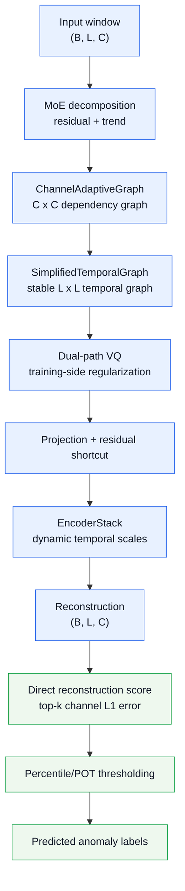

# LaGraph Architecture

Date: 2026-05-25
Branch: `codex/5070-env-migration`
Runtime target: RTX 5070 single GPU

## Positioning

LaGraph is currently a compact reconstruction-based multivariate time-series
anomaly detector. The stable main profile is `full`, which keeps the dual-graph
representation, VQ regularization, EncoderStack temporal-scale encoding, and
direct reconstruction anomaly scoring.

The current system should not be described as a large module-stacking method.
Several earlier modules have been removed or moved to ablation-only status
because recent experiments did not support them as reliable contributors.

The strongest current paper direction is:

- a compact reconstruction backbone with channel-structure support;
- hierarchical RCA and local counterfactual attribution;
- transparent negative ablations showing why unused modules were removed;
- efficiency and auditability as explicit paper objectives;
- optional future extension toward explicit causal structure learning.

Large metric gains are still possible, but they are unlikely to come from adding
more generic blocks. The best remaining opportunities are causal/structural graph
learning and score calibration. Until those are implemented and validated, the
paper should emphasize interpretability, efficiency, and stability rather than
claiming a universal metric lead.

## Paper-Level Trade-Off Policy

The current system should not be optimized as a detector-only leaderboard model.
If the method cannot become SOTA on every dataset and metric, the paper should
make an explicit trade: accept a small detection-performance gap only when it
buys a measurable paper contribution. That contribution can be metric-based
or explanation-based, but it must be evaluable.

Acceptable trade-offs:

| Trade-off | Acceptable only if | Reviewer risk |
| --- | --- | --- |
| Slightly lower raw F1 | Affiliation F1, RCA ranking, or delay improves under a fixed protocol | hiding weak point-wise detection |
| Slightly lower adjusted F1 | Predicted-event RCA coverage and delay remain competitive | threshold or segment tuning |
| Extra graph module | The learned structure is visualizable and gives faithful diagnostic evidence, even if detection metrics only tie | module stacking |
| Removing a module | Runtime/parameter count drops and detection/RCA does not collapse | underpowered architecture |
| Dataset-specific sensitivity | Reported as sensitivity, not promoted as a universal default | cherry-picking |
| Interpretability-only module | It produces a clear formula, figure, case study, and ablation showing what explanation would be lost without it | system-feature drift |

Non-acceptable trade-offs:

- large raw F1 or adjusted F1 degradation with only a tiny affiliation gain;
- post-processing that inflates event coverage but weakens RCA or precision;
- a graph or causal module that cannot be explained in one figure;
- an explanation module whose output is not faithful to model behavior or input perturbations;
- any setting chosen only because it is best on the test labels.

Practical paper stance:

```text
LaGraph is not positioned as a universal SOTA detector. It is positioned as a
compact industrial anomaly diagnosis framework that balances detection,
hierarchical RCA, interpretability, and single-GPU efficiency.
```

This does not mean every main contribution must improve detection metrics. A
module can be paper-worthy if it materially improves interpretability while
leaving detection nearly unchanged. The review standard is whether the module
supports a defensible scientific claim, not whether it adds another system
feature.

## Main Profile

The default profile for reporting is `full`.

| Component | Status | Role |
| --- | --- | --- |
| MoE decomposition | kept | separates trend and residual signals |
| Channel adaptive graph | kept | models cross-variable dependency |
| Fixed temporal graph | kept | provides stable temporal refinement |
| Dual-path VQ bottleneck | kept | regularizes normal-pattern representation during training |
| EncoderStack | kept | dynamic temporal-scale feature extraction |
| Direct reconstruction scoring | kept | main anomaly ranking signal |
| BoundaryDetector | removed | unsupported after simplification |
| Multi-scale/VQ scorer | ablation only | old scoring path, not consistently better |
| Prediction/contrastive/frequency/prototype switches | removed | dead switches in current single-run path |

The strongest adaptive-temporal candidate is `dynamic-temporal-gated`. It
replaces the fixed temporal graph with a content-adaptive temporal graph and a
residual gate. It improves raw F1 and SWaT affiliation F1, but it is not a
uniform replacement for `full` because MSL affiliation F1 and SWaT adjusted F1
can drop.

The newest research candidate is `state-aware`. It keeps the stable serial
`full` path, estimates a latent operating state from each input window, and uses
state-specific gates to decide how strongly a parallel channel/temporal graph
fusion should correct the serial representation. This profile is intended to
support the industrial multi-condition generalization narrative. It has passed
smoke tests but does not yet have full 15-epoch benchmark results.

The reviewer-driven graph candidates now separate two hypotheses.
`prior-guided-graph` hard-mixes a normal-state correlation prior into the
learned channel graph. It improves graph-neighbor faithfulness, but early HAI
tests show that the hard prior can damage detection on distribution-shifted
events. It is therefore a stress-test candidate rather than the main method.
`structure-consistent` keeps the `full` forward backbone unchanged and uses the
normal-state graph only as a weak alignment loss. This is the preferred
paper-level hypothesis because it asks a narrower and more defensible question:
can a normal-structure consistency constraint make the learned graph more
faithful without replacing the adaptive graph used for detection?

Additional 2026-05-24 architecture candidates were tested but not promoted:
`parallel-dual`, `parallel-dual-time`, `residual-dual`,
`residual-dual-time`, `graph-shift`, `graph-shift-lite`, and
`graph-shift-strong`. Lag-constrained causal branches were added as
`causal-lag`, `causal-lag-score`, `causal-lag-score-strong`,
`causal-cf-gain`, and `causal-cf-hurt`. Inference-time score aggregation
variants and the `synthetic-aux` self-supervised perturbation profile were also
added. These remain reproducibility profiles rather than main paper
architecture until the gains are confirmed across more datasets and seeds.

## System Flow



## Module Details

### MoE Decomposition

File: `ts_benchmark/baselines/self_impl/LaGraph/decomp.py`

Input shape is `(B, L, C)`. The module decomposes each window into:

- residual: anomaly-sensitive local fluctuation;
- trend: smoother low-frequency component.

The model reconstructs `residual + trend` at the output. This keeps the detector
within a self-supervised reconstruction setting and avoids relying on anomaly
labels during training.

### ChannelAdaptiveGraph

File: `ts_benchmark/baselines/self_impl/LaGraph/graph_learner.py`

The channel graph models variable-to-variable dependency. It combines:

- learned channel prior embeddings;
- data-driven dependency from pooled residual features;
- gated fusion between prior and data terms;
- top-k sparsification;
- single-layer message passing to avoid over-smoothing.

The output is `resid_adapted` and an interpretable `C x C` adjacency matrix.
This is currently the strongest architectural component for paper narrative
because it has a direct multivariate interpretation.

### Temporal Graph

The stable `full` profile uses `SimplifiedTemporalGraph`.

The candidate `dynamic-temporal-gated` profile uses `DynamicTemporalGraph`,
which generates an adaptive temporal adjacency by QK attention over the current
window, applies row-wise top-k sparsity, then mixes dynamic temporal aggregation
with local convolution through a residual gate.

Current evidence:

- fixed temporal graph is more stable as the main method;
- gated dynamic temporal graph improves raw F1 and SWaT affiliation F1;
- dynamic temporal graph is sensitive to residual strength and top-k sparsity;
- tested residual-init `0.05/0.20` and dynamic top-k `8/50` were worse than the
  default gated setting.

### Dual-Path VQ

File: `ts_benchmark/baselines/self_impl/LaGraph/vq_bottleneck.py`

VQ is retained as a training-side regularizer. It should not be described as the
main anomaly score.

Current default:

```text
vq_cooldown_epochs = 10
lambda_vq = 0.1
vq_score_weight = 0.3
```

During cooldown, VQ-related parameters are trained first. After cooldown, the
main reconstruction path is trained with reconstruction loss, channel sparsity
regularization, and VQ loss.

Direct VQ score fusion was tested and rejected:

| Variant | Raw F1 | Adjusted F1 | Affiliation F1 | Decision |
| --- | ---: | ---: | ---: | --- |
| `dynamic-temporal-gated` | 0.1139 | 0.8577 | 0.6940 | baseline candidate |
| VQ score weight 0.10 | 0.1160 | 0.8583 | 0.6941 | reject |
| VQ score weight 0.02 | 0.1152 | 0.8577 | 0.6958 | reject |

The result supports using VQ for representation regularization, not direct
score addition.

### EncoderStack

File: `ts_benchmark/baselines/self_impl/LaGraph/temporal_encoder.py`

The encoder uses two layers with:

- multi-scale temporal convolution;
- dynamic scale selection;
- multi-head attention;
- feed-forward projection.

The current default model capacity is intentionally small:

```text
d_model = 128
e_layers = 2
n_heads = 4
dropout = 0.25
```

This gives roughly 0.4M trainable parameters, depending on the dataset channel
count and profile.

### Direct Reconstruction Scoring

File: `ts_benchmark/baselines/self_impl/LaGraph/gcn_model.py`

The main path uses direct reconstruction error:

```text
err = L1(rec, input)
score_t = mean(top-k channel errors at time t)
```

The old multi-scale scorer exists only for `with-scorer` ablation. It is not the
default because direct reconstruction scoring was more stable in recent tests.

`detect_score` aggregates overlapping window scores back to point-level scores
by averaging all windows covering each timestamp. `detect_label` then evaluates
standard anomaly-ratio thresholds and a POT default threshold.

## Training Objective

The main training objective is:

```text
loss = reconstruction_loss(reconstruction, input)
     + lambda_locality_l1 * sparse_channel_loss
     + lambda_vq * vq_loss
```

The default reconstruction loss remains MSE. The code now also supports
`mae`, `smooth_l1`, `log_cosh`, `charbonnier`, and `mse_mae` for controlled
loss-function sensitivity experiments. A first-difference temporal loss is also
implemented as an optional candidate:

```text
loss = loss + lambda_temporal_diff_loss * MSE(diff(reconstruction), diff(input))
```

Important details:

- no supervised anomaly labels are used during training;
- robust/trimmed reconstruction loss was tested and rejected;
- `log_cosh` and `smooth_l1` improved MSL affiliation F1 but degraded SWaT, so
  they are not promoted to the default loss;
- first-difference reconstruction loss was tested and rejected on MSL;
- temporal graph smoothness/locality regularization was tested and rejected;
- channel-normalized scoring was tested and rejected.

## Runtime Profiles

| Profile | Channel graph | Temporal graph | VQ | Scorer | Use |
| --- | ---: | ---: | ---: | ---: | --- |
| `full` | on | fixed | on | direct reconstruction | main method |
| `dynamic-temporal` | on | dynamic | on | direct reconstruction | ungated dynamic temporal ablation |
| `dynamic-temporal-gated` | on | dynamic + residual gate | on | direct reconstruction | strongest adaptive-temporal candidate |
| `prior-guided-graph` | normal-correlation-guided | fixed | on | direct reconstruction | graph-faithfulness candidate |
| `structure-consistent` | adaptive + weak normal-prior loss | fixed | on | direct reconstruction | preferred graph-faithfulness candidate |
| `state-aware` | on | fixed + state-aware correction | on | direct reconstruction | newest industrial multi-condition candidate |
| `state-aware-dynamic` | on | dynamic + state-aware correction | on | direct reconstruction | dynamic state-aware candidate |
| `state-aware-causal` | on | fixed + state-aware correction | on | reconstruction + counterfactual lagged score | RCA-oriented candidate |
| `parallel-dual` | on | fixed, parallel branch | on | direct reconstruction | rejected dual-graph fusion candidate |
| `parallel-dual-time` | on | fixed, time-gated parallel branch | on | direct reconstruction | rejected dual-graph fusion candidate |
| `residual-dual` | on | fixed, residual parallel correction | on | direct reconstruction | rejected conservative fusion candidate |
| `residual-dual-time` | on | fixed, time-gated residual correction | on | direct reconstruction | rejected conservative fusion candidate |
| `graph-shift` | on | fixed | on | reconstruction + graph-shift score | rejected structure-shift scoring candidate |
| `causal-lag` | on | fixed | on | direct reconstruction | lagged mechanism branch, score off |
| `causal-lag-score` | on | fixed | on | reconstruction + lagged mechanism score | first causal-score candidate |
| `synthetic-aux` | on | fixed | on | reconstruction + synthetic-head score | industrial perturbation auxiliary candidate |
| `synthetic-aux-q75` | on | fixed | on | q75 aggregation + synthetic-head score | rejected combination candidate |
| `full-event-affinity-lite` | on | fixed | on | smoothed reconstruction + segment shaping | rejected event-coverage candidate |
| `full-event-affinity` | on | fixed | on | stronger segment shaping | reproducibility candidate |
| `full-event-affinity-strong` | on | fixed | on | aggressive segment shaping | reproducibility candidate |
| `full-event-persistence` | on | fixed | on | event-persistence score amplification | rejected sustained-event scoring candidate |
| `loss-smoothl1` | on | fixed | on | direct reconstruction | SmoothL1 loss sensitivity candidate |
| `loss-logcosh` | on | fixed | on | direct reconstruction | log-cosh loss sensitivity candidate |
| `loss-mse-mae` | on | fixed | on | direct reconstruction | mixed MSE/MAE loss candidate |
| `loss-mse-logcosh` | on | fixed | on | direct reconstruction | conservative MSE/log-cosh loss candidate |
| `loss-mse-smoothl1` | on | fixed | on | direct reconstruction | conservative MSE/SmoothL1 loss candidate |
| `loss-diff` | on | fixed | on | direct reconstruction | first-difference loss candidate |
| `loss-smoothl1-diff` | on | fixed | on | direct reconstruction | SmoothL1 plus first-difference loss candidate |
| `with-scorer` | on | fixed | on | old multi-scale scorer | old scoring ablation |
| `no-vq` | on | fixed | off | old multi-scale scorer | VQ ablation |
| `channel-only` | on | off | on | direct reconstruction | channel graph ablation |
| `temporal-only` | off | fixed | on | direct reconstruction | temporal graph ablation |
| `reconstruction` | off | off | off | direct reconstruction | lower-bound baseline |

Rejected experimental profiles are kept for reproducibility:

- `dynamic-temporal-regularized`;
- `dynamic-temporal-robust`;
- `dynamic-temporal-robust-lite`;
- `dynamic-temporal-channelnorm`;
- `dynamic-temporal-channelnorm-scale`;
- `dynamic-temporal-gated-vqscore`;
- affiliation-oriented smoothing/segment-shaping variants.

## Current Experimental Summary

Three-seed checks on MSL and SWaT show that `full` is the safer main method.

| Profile | Dataset | Raw F1 mean | Adjusted F1 mean | Affiliation F1 mean | Interpretation |
| --- | --- | ---: | ---: | ---: | --- |
| `full` | MSL | 0.1078 | 0.8561 | 0.6980 | stable baseline |
| `full` | SWaT | 0.3138 | 0.9296 | 0.8441 | stable baseline |
| `dynamic-temporal-gated` | MSL | 0.1158 | 0.8559 | 0.6934 | better raw F1, worse affiliation |
| `dynamic-temporal-gated` | SWaT | 0.3417 | 0.9187 | 0.8528 | better raw/affiliation, worse adjusted |

Current conclusion:

- If the paper prioritizes robustness and balanced reporting, use `full` as the
  main architecture.
- If the paper needs an adaptive temporal graph story, report
  `dynamic-temporal-gated` as an important extension or ablation, not as a
  universally better replacement.
- Do not claim every module improves every metric. The evidence supports a more
  rigorous claim: the compact architecture is stable, efficient, and
  interpretable; adaptive temporal graphing improves some ranking/event metrics
  but has dataset-dependent tradeoffs.

## Latest Architecture Search

MSL seed-2021, 15 epochs, current aligned code path:

| Profile | Main change | Raw F1 | Adjusted F1 | Affiliation F1 | Decision |
| --- | --- | ---: | ---: | ---: | --- |
| `full` | stable compact architecture | 0.1109 | 0.8576 | 0.7006 | keep main |
| `parallel-dual-time` | channel and temporal branches fused by time-wise gate | 0.1189 | 0.8579 | 0.6938 | reject; raw improves but affiliation drops |
| `residual-dual-time` | `full` plus small time-wise parallel residual | 0.1081 | 0.8577 | 0.6998 | reject; near-affiliation tie but no gain |
| `graph-shift` | add normal-graph deviation to anomaly score | 0.1097 | 0.8572 | 0.7001 | reject; interpretable but not better |
| `graph-shift-lite` | lower graph-shift weight | 0.1105 | 0.8576 | 0.6959 | reject |
| `causal-lag-score` | lagged parent mechanism, detached backbone, score weight 0.05 | 0.1102 | 0.8574 | 0.6983 | reject as main; keep as causal prototype |
| `causal-cf-hurt` | counterfactual parent-hurt score, weight 0.10, top-k 5 | 0.1109 | 0.7987 | 0.7024 | candidate; small affiliation gain only |
| `synthetic-aux` | synthetic industrial perturbation auxiliary loss, score weight 0.10 | 0.1113 | 0.8576 | 0.7023 | candidate; small affiliation gain only |

Interpretation: the issue with the dual graph is not just serial ordering. The
unsupervised reconstruction objective gives no direct supervision for a fusion
gate to learn "when to trust channel versus temporal structure." Parallel and
residual fusion therefore change score ranking, but do not improve event-level
affiliation on MSL. Graph-shift scoring is more interpretable, but the learned
same-time channel graph is too stable on MSL to add useful anomaly evidence.
The first lagged causal branch confirms that temporal-precedence constraints are
implementable, but a simple lagged reconstruction residual is not yet
discriminative enough to improve affiliation F1. The counterfactual
parent-hurt score gives the first positive MSL affiliation signal, but the
margin is small and adjusted F1 drops, so it should be treated as a candidate
rather than the main reported architecture.

## Graph Faithfulness Check

A reviewer-facing masking protocol was added in
`scripts/evaluate_graph_faithfulness.py`. It tests whether explanation-aligned
channels actually affect model behavior:

```text
mask top RCA channels / graph neighbors / random channels / non-neighbors
then measure anomaly-score and reconstruction-error change.
```

HAI_21_03_test1, 5 epochs, five metadata events:

| Neighbor source | Top-vs-random score margin | Neighbor-vs-random score margin | Interpretation |
| --- | ---: | ---: | --- |
| learned graph in `full` | 11.3826 | -0.0077 | top RCA is faithful; learned graph neighbors are not reliably better than random |
| normal correlation graph | 11.3826 | 0.2094 | normal-state dependency prior has faithful explanatory signal |
| same subsystem group | 11.3826 | -0.0477 | subsystem membership alone is not enough |
| `prior-guided-graph` learned graph | 11.3813 | 0.3793 | prior-guided learning improves graph-neighbor faithfulness |

Initial detection check on HAI_21_03_test1, 5 epochs:

| Profile | Threshold | Raw F1 | Adjusted F1 | Affiliation F1 |
| --- | --- | ---: | ---: | ---: |
| `full` | POT | 0.2333 | 0.3733 | 0.9582 |
| `prior-guided-graph` | POT | 0.2292 | 0.3714 | 0.9975 |
| `full` | 1.0% | 0.1589 | 0.1881 | 0.8296 |
| `prior-guided-graph` | 1.0% | 0.1841 | 0.2166 | 0.8846 |

Interpretation: the original channel graph should not be claimed as a faithful
explanation graph. The normal-dependency prior contains useful explanatory
signal, but hard-mixing it into the forward graph is risky: on
HAI_21_03_test2, `prior-guided-graph` improved learned-neighbor masking margins
but sharply reduced detection F1. The promoted direction is therefore not a
hard prior graph, but `structure-consistent`: the adaptive graph remains the
forward graph, while the normal graph acts only as a weak training constraint.
This keeps the detection and RCA story unified without turning RCA into a
separate post-hoc subsystem.

## Score Aggregation and Synthetic Auxiliary Check

MSL seed-2021, 15 epochs, current aligned code path:

| Profile / setting | Raw F1 | Adjusted F1 | Affiliation F1 | Decision |
| --- | ---: | ---: | ---: | --- |
| `full`, mean aggregation | 0.1109 | 0.8576 | 0.7006 | main baseline |
| `full --score-aggregation q75` | 0.1097 | 0.8575 | 0.7018 | small positive, not enough |
| `full --score-aggregation q80` | 0.1105 | 0.8576 | 0.6983 | reject |
| `full --score-aggregation q90` | 0.1108 | 0.8578 | 0.7004 | reject |
| `full --score-aggregation max` | 0.1225 | 0.7940 | 0.6955 | raw improves, event quality drops |
| `full --score-aggregation center --score-center-width 5` | 0.1136 | 0.8574 | 0.7003 | reject |
| `full --score-aggregation last` | 0.1064 | 0.8572 | 0.6933 | reject |
| `synthetic-aux` | 0.1113 | 0.8576 | 0.7023 | current best candidate, still small |
| `synthetic-aux-q75` | 0.1098 | 0.8577 | 0.7004 | reject |
| `synthetic-aux --synthetic-score-weight 0.20` | 0.1113 | 0.8576 | 0.7023 | no gain over 0.10 |

Interpretation: changing the overlapping-window aggregation alone does not
solve the event-level bottleneck. Conservative q75 aggregation gives a small
affiliation gain, while max aggregation improves raw F1 but damages adjusted and
affiliation metrics. The synthetic industrial perturbation auxiliary objective
is the best current signal, but its margin is still too small to promote before
multi-seed and SWaT validation.

## Reconstruction Loss Search

The loss-function search tested whether a reconstruction objective more robust
than MSE can improve event-level localization without adding new architecture
modules. MSL and SWaT were run with seed 2021, 15 epochs,
`num_workers=2`, and `prefetch_factor=2`. Reported values are the best values
over the standard anomaly-ratio grid.

| Profile | Dataset | Raw F1 | Adjusted F1 | Affiliation F1 | Decision |
| --- | --- | ---: | ---: | ---: | --- |
| `full` | MSL | 0.1109 | 0.8576 | 0.7006 | MSE baseline |
| `loss-smoothl1` | MSL | 0.1090 | 0.8572 | 0.7052 | positive MSL-only candidate |
| `loss-logcosh` | MSL | 0.1097 | 0.8573 | 0.7059 | best MSL affiliation candidate |
| `loss-mse-mae` | MSL | 0.1114 | 0.8575 | 0.7017 | too small |
| `loss-mse-logcosh` | MSL | 0.1111 | 0.8574 | 0.7004 | reject |
| `loss-mse-smoothl1` | MSL | 0.1111 | 0.8575 | 0.7003 | reject |
| `loss-diff` | MSL | 0.1104 | 0.8579 | 0.6994 | reject |
| `loss-smoothl1-diff` | MSL | 0.1111 | 0.8574 | 0.6929 | reject |
| `full` | SWaT | 0.3169 | 0.9361 | 0.8458 | MSE baseline |
| `loss-logcosh` | SWaT | 0.2800 | 0.9269 | 0.8168 | reject as default |
| `loss-smoothl1` | SWaT | 0.2810 | 0.9257 | 0.8172 | reject as default |

Interpretation: robust losses reduce the influence of large reconstruction
errors during training. This helps MSL affiliation F1, suggesting that MSL
benefits from a less outlier-dominated normal reconstruction objective. The same
change hurts SWaT raw, adjusted, and affiliation F1, which means the effect is
dataset-sensitive rather than a general improvement. The default paper profile
should therefore keep MSE. `loss-logcosh` and `loss-smoothl1` can be reported as
loss sensitivity ablations or revisited for industrial datasets whose normal
training data contain more outlier-like contamination.

A conservative mixed objective was also tested after the first loss sweep:
`0.9*MSE + 0.1*log_cosh` and `0.9*MSE + 0.1*SmoothL1`. Both were essentially
tied with MSE on MSL but did not improve affiliation F1. This suggests that the
MSL gain from pure robust losses requires a strong change in gradient shape,
while weak robust regularization is not enough to alter event ranking.

## Channel Score Aggregation Check

The direct reconstruction score uses the mean of the top-k channel errors at
each timestamp. MSL seed-2021, 15 epochs:

| Setting | Raw F1 | Adjusted F1 | Affiliation F1 | Decision |
| --- | ---: | ---: | ---: | --- |
| default top-k | 0.1109 | 0.8576 | 0.7006 | keep |
| `--score-topk-k 3` | 0.1085 | 0.8575 | 0.7005 | no gain |
| `--score-topk-k 8` | 0.1108 | 0.8578 | 0.6972 | reject |

Interpretation: the current MSL bottleneck is not resolved by simply narrowing
or widening the number of contributing channels in the anomaly score. The
default top-k setting remains the safest choice.

## Event-Affiliation Search

A separate search tested whether point-wise precision can be sacrificed for
better affiliation F1. These variants add event-continuity priors at inference:
score smoothing, gap filling, minimum segment length, dilation, and a
score-level event-persistence amplifier that boosts sustained high-score
regions before thresholding.

MSL seed-2021, 15 epochs:

| Profile / setting | Raw F1 | Adjusted F1 | Affiliation F1 | Decision |
| --- | ---: | ---: | ---: | --- |
| `full` | 0.1109 | 0.8576 | 0.7006 | main baseline |
| `loss-logcosh` | 0.1097 | 0.8573 | 0.7059 | best MSL affiliation candidate |
| `full-event-affinity-lite` | 0.1106 | 0.6991 | 0.6804 | reject |
| smoothing + gap fill + min length | 0.1123 | 0.6639 | 0.6876 | reject |
| `full-event-persistence` | 0.1104 | 0.8586 | 0.6956 | reject |
| `loss-logcosh` + event persistence | 0.1091 | 0.8598 | 0.6970 | reject |

Interpretation: affiliation F1 can be improved on MSL, but not by naively
expanding or smoothing predicted segments. Segment shaping increases event
coverage at the cost of too many poorly placed positives, so affiliation
precision drops faster than recall improves. The only positive affiliation
signal in this sweep comes from the reconstruction objective itself
(`log_cosh`), which changes how normal reconstruction is learned rather than
how labels are post-processed. For paper writing, this supports a stricter
claim: affiliation-oriented gains should come from representation or training
objective design, not from threshold-time segment inflation.

## Causal Inference Status

The current code has graph learning and locality/proximity language, but it does
not yet implement causal inference in the strict sense. A learned channel
adjacency should not be called a causal graph unless additional identification
or intervention-style constraints are added.

For a stronger CCF-A-level contribution, causal inference can be made concrete
in the following way.

```mermaid
flowchart LR
    accTitle: Causal Extension Roadmap
    accDescr: Practical path from current dependency graph learning to a defensible causal graph module.

    dep["Current channel graph<br/>dependency adjacency"]
    lag["Lagged candidate causes<br/>X(t-k) -> X(t)"]
    mask["Sparse causal mask<br/>learned with acyclicity or lag constraint"]
    invariant["Invariant normal dynamics<br/>stable across windows/datasets"]
    anomaly["Causal residual score<br/>violation of learned mechanisms"]
    evidence["Ablation evidence<br/>causal mask vs dependency graph"]

    dep --> lag
    lag --> mask
    mask --> invariant
    invariant --> anomaly
    anomaly --> evidence

    classDef current fill:#e8f1ff,stroke:#2563eb,stroke-width:1px,color:#111827
    classDef future fill:#fff7ed,stroke:#ea580c,stroke-width:1px,color:#111827
    class dep current
    class lag,mask,invariant,anomaly,evidence future
```



Recommended implementation direction:

| Idea | Concrete implementation | Why it is defensible |
| --- | --- | --- |
| Lagged causal graph | learn edges from `X_j(t-k)` to `X_i(t)` instead of same-time correlation only | respects temporal precedence |
| Granger-style sparsity | compare prediction/reconstruction with and without candidate lagged parents | gives an operational causal criterion |
| Mechanism invariance | require learned parent-child mechanisms to stay stable across windows or datasets | aligns with causal invariance |
| Interventional dropout | randomly mask parent channels and penalize unstable reconstructions | tests whether an edge carries functional information |
| Causal residual score | score violations of learned mechanisms separately from raw reconstruction error | produces interpretable anomaly causes |

This direction has a real chance to improve results, but it must be validated
with ablations. The claim should be:

```text
causal-structured dependency learning improves anomaly localization and
interpretability
```

not:

```text
the current dependency graph is already a causal graph
```

## Practical Next Step

Do not spend more experiments on generic dual-graph fusion. The higher-priority
architecture direction remains a lagged causal/structural graph on top of the
stable `full` profile, but the first prototype should be treated as negative
evidence rather than a final causal module:

```text
parents_i(t) = sparse set of X_j(t-k), k > 0
mechanism_i = f_i(parents_i(t))
score = reconstruction_error + mechanism_violation
```

This gives the paper a concrete causal claim through temporal precedence and
mechanism violation. The next version should not merely add the lagged residual
as a score. It should learn sparse parent mechanisms with stronger
counterfactual tests, for example masking candidate parents and measuring the
change in reconstruction or mechanism residual. A fixed/dynamic temporal
mixture can still be tested later, but it has lower priority than making the
channel graph causally meaningful.

## Commands

Main method:

```powershell
D:\Anaconda3\envs\lagraph5070\python.exe ts_benchmark/run_single.py --epochs 15 --datasets MSL.csv swat.csv --arch-profile full --num-workers 2 --prefetch-factor 2 --save-dir label/LaGraph_main_15ep
```

Adaptive temporal candidate:

```powershell
D:\Anaconda3\envs\lagraph5070\python.exe ts_benchmark/run_single.py --epochs 15 --datasets MSL.csv swat.csv --arch-profile dynamic-temporal-gated --num-workers 2 --prefetch-factor 2 --save-dir label/LaGraph_candidate_dynamic_temporal_gated_15ep
```

Key ablations:

```powershell
D:\Anaconda3\envs\lagraph5070\python.exe ts_benchmark/run_single.py --epochs 15 --arch-profile channel-only --num-workers 2 --prefetch-factor 2 --save-dir label/LaGraph_ablation_channel_only
D:\Anaconda3\envs\lagraph5070\python.exe ts_benchmark/run_single.py --epochs 15 --arch-profile temporal-only --num-workers 2 --prefetch-factor 2 --save-dir label/LaGraph_ablation_temporal_only
D:\Anaconda3\envs\lagraph5070\python.exe ts_benchmark/run_single.py --epochs 15 --arch-profile no-vq --num-workers 2 --prefetch-factor 2 --save-dir label/LaGraph_ablation_no_vq
D:\Anaconda3\envs\lagraph5070\python.exe ts_benchmark/run_single.py --epochs 15 --arch-profile with-scorer --num-workers 2 --prefetch-factor 2 --save-dir label/LaGraph_ablation_with_scorer
```

## Reporting Guidance

For the paper, report:

- `full` as the main compact method;
- `dynamic-temporal-gated` as adaptive temporal graph extension;
- `channel-only`, `temporal-only`, `no-vq`, `with-scorer`, and
  `reconstruction` as ablations;
- three-seed mean and standard deviation;
- raw F1, adjusted F1, and affiliation F1 together;
- parameter count and single-GPU runtime settings;
- negative ablations as evidence that the final system is not module stacking.

Do not over-optimize only one metric in the main table. It is acceptable to
emphasize affiliation F1 if the paper's task framing is event-level anomaly
coverage, but raw F1 and adjusted F1 should still be reported transparently.

## File Map

```text
ts_benchmark/baselines/self_impl/LaGraph/
  LaGraph.py            training, validation, thresholding, scoring pipeline
  gcn_model.py          SparseGCN, VQ integration, reconstruction scoring
  graph_learner.py      ChannelAdaptiveGraph, SimplifiedTemporalGraph, DynamicTemporalGraph
  temporal_encoder.py   EncoderStack and temporal feature extraction
  decomp.py             MoE decomposition
  vq_bottleneck.py      VQ bottleneck
  attention.py          attention blocks
  RevIN.py              reversible normalization utility
  channel_mask.py       channel mask utility
```

## Known Limitations

| Limitation | Impact | Recommendation |
| --- | --- | --- |
| Current graph is dependency-based, not causal | causal claims are not yet justified | add lagged causal graph and invariance tests |
| `dynamic-temporal-gated` is dataset-dependent | improves SWaT but weakens MSL affiliation | keep as extension, not default |
| Direct VQ score fusion is weak | VQ does not reliably improve ranking as a score | use VQ as training regularizer |
| Post-processing hurt MSL affiliation | generic smoothing/segment shaping is unsafe | focus on representation and calibrated scoring |
| Synthetic auxiliary gain is small | improves MSL affiliation by about 0.0017 only | keep as candidate; validate across seeds/datasets |
| Available default benchmark set currently excludes SMD | all-dataset claims are limited | report exclusions and optionally run SMD separately |

Last updated: 2026-05-25.
