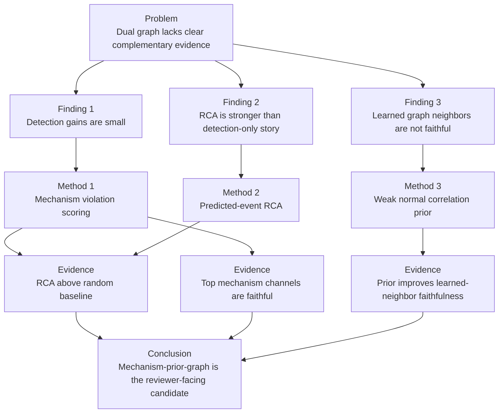
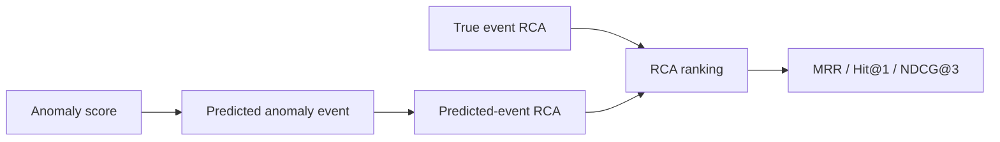

# 组会汇报脚本：从双图异常检测到机制感知异常诊断

日期：2026-05-27  
项目：LaGraph / 工业多变量时间序列异常检测与根因诊断  
当前主线：`mechanism-prior-graph`

## 汇报主旨

本周工作的核心不是继续堆叠模块追求单一检测指标，而是从审稿人会质疑的问题出发，重新梳理系统的科学问题：

> 原始双图结构虽然合理，但 learned graph 的边解释不稳定。我们因此将通道图从普通特征传播模块改造成“正常变量依赖机制”的可检验表示，并进一步用弱正常结构先验提升 learned edge 的行为可信度。

最终形成的论文主线是：

```text
工业异常不仅表现为点级重构误差，也表现为正常变量依赖机制的破坏。
因此，我们提出机制感知图诊断框架，在保持检测性能基本不变的同时，
提升根因诊断能力和图边解释的 faithfulness。
```

## 整体逻辑图



## PPT 第 1 页：标题页

### 页面提示词

生成一页学术组会汇报标题页。标题为“从双图异常检测到机制感知异常诊断”。副标题为“LaGraph 近期架构演化与实验结论”。页面应体现工业多变量时间序列、异常检测、根因诊断和可解释性四个关键词。视觉风格应简洁、研究型、计算机论文风格，不要做成产品宣传页。

### 页面内容

标题：从双图异常检测到机制感知异常诊断  
副标题：LaGraph 近期架构演化与实验结论  
汇报重点：

- 原始问题：双图结构的贡献和解释性不足；
- 方法变化：从 learned graph 转向 mechanism-aware graph；
- 当前结果：RCA 与 faithfulness 比单纯检测指标更有价值；
- 当前候选：`mechanism-prior-graph`。

### 讲稿提示

这次汇报不是单纯展示某个指标涨了多少，而是解释我们如何从原始双图结构中发现问题，并将系统转向更适合论文表达的机制感知异常诊断框架。

## PPT 第 2 页：研究背景与目标

### 页面提示词

生成一页研究背景页。主题是工业多变量时间序列异常检测。页面左侧展示工业传感器变量之间存在结构依赖，右侧展示异常检测之后还需要定位根因。强调本工作目标不是单纯检测异常点，而是面向工业诊断。

### 页面内容

研究对象：

- 工业多变量时间序列；
- 变量之间存在设备、流程、控制逻辑依赖；
- 异常通常表现为事件，而非孤立异常点。

研究目标：

- 检测异常事件；
- 定位异常子系统或根因变量；
- 提供可被审稿人检验的解释证据。

核心转变：

```text
Detection-only -> Detection + Diagnosis + Faithfulness
```

### 讲稿提示

工业场景中，仅仅知道“异常发生了”是不够的。更有价值的问题是异常和哪些变量、哪些子系统有关，以及模型给出的解释是否真的影响模型行为。

## PPT 第 3 页：原始双图设计与问题

### 页面提示词

生成一页问题分析页。画出原始双图结构：通道图建模变量关系，时间图建模时间动态。然后在图旁边标出三个问题：串联结构不证明互补性、性能提升有限、learned graph 边解释不稳定。

### 页面内容

原始设计：

- Channel graph：建模变量之间的依赖；
- Temporal graph：建模窗口内部时间依赖；
- Reconstruction score：作为主要异常分数。

发现的问题：

| 问题 | 表现 | 审稿风险 |
| --- | --- | --- |
| 双图互补性不清楚 | 串联后无法证明两个图各自贡献 | 被认为是模块堆叠 |
| 检测指标提升有限 | 多数结构微调只带来小变化 | 难以主打 SOTA detection |
| learned graph 边不稳定 | graph neighbors 有时不如随机通道 | 解释性不足 |

### 讲稿提示

原始双图思想不是错误的，但论文表达不够强。审稿人会问：通道图和时间图到底是否学到了互补信息？learned graph 的边是否真的可以解释异常？

## PPT 第 4 页：关键发现 1，检测指标不是最强主线

### 页面提示词

生成一页实验发现页。页面包含一个简洁表格和结论框。表格说明多次架构微调后检测指标变化有限。结论框写“检测性能可用，但不适合单独作为论文核心卖点”。

### 页面内容

检测层面的结论：

- raw F1、adjusted F1、affiliation F1 多数变化有限；
- 提高 affiliation F1 有价值，但单靠检测指标不足以支撑强论文；
- 当前更合理定位是 competitive detection，而不是 universal SOTA detector。

论文判断：

```text
如果只讲检测，我们处于中等偏可用；
如果讲检测 + RCA + faithful explanation，论文价值更清晰。
```

### 讲稿提示

这一步很关键。我们没有继续盲目堆模块，因为实验已经说明单纯检测提升进入局部瓶颈。后续工作转向“诊断”和“解释可信度”。

## PPT 第 5 页：关键发现 2，RCA 方向更有价值

### 页面提示词

生成一页 RCA 结果页。中心放表格，展示 true-event RCA、predicted-event RCA 和 random baseline 的 MRR、Hit@1。右侧用简短文字解释 predicted-event RCA 比 true-event RCA 更接近真实系统。

### 页面内容

HAI 五文件 RCA 结果：

| 评估方式 | MRR | Hit@1 | 解释 |
| --- | ---: | ---: | --- |
| True-event RCA | 0.9817 | 0.9633 | 给定真实异常区间后的根因排序 |
| Predicted-event RCA | 0.8942 | 0.8533 | 使用模型预测事件做 RCA |
| Random baseline | 0.5615 | 0.3232 | 随机排序基线 |

结论：

- RCA 明显优于随机基线；
- predicted-event RCA 说明系统不是只做事后解释；
- 这比单纯检测指标更适合作为工业诊断论文主线。

### 讲稿提示

true-event RCA 是较容易的设置，而 predicted-event RCA 更接近实际部署。我们的 predicted-event RCA 仍然明显优于随机基线，这是目前最重要的正结果之一。

## PPT 第 6 页：从通道图到机制图

### 页面提示词

生成一页方法页。展示变量 `X_i` 由图邻居 `X_neighbors(i)` 预测，误差作为 mechanism violation。强调通道图不再只是 message passing，而是正常变量依赖机制的表示。

### 页面内容

核心思想：

```text
X_hat_i = f(X_neighbors(i; G))
mechanism violation_i = |X_i - X_hat_i|
```

含义：

- 如果系统正常，变量应能被其正常邻居解释；
- 如果异常破坏变量关系，机制违背分数升高；
- 图从“特征传播结构”变成“正常运行机制”的可检验表示。

术语边界：

- 可以说 mechanism-aware；
- 可以说 causal-inspired；
- 暂时不应直接说 causal discovery。

### 讲稿提示

这是方法转变的核心。我们不是简单加图，而是赋予通道图一个可检验的任务：用邻居解释目标变量。这样图边和异常分数之间有了更明确的关系。

## PPT 第 7 页：机制感知 RCA 评估协议

### 页面提示词

生成一页评估协议页。用流程图表示从检测分数到异常事件，再到 RCA 排名，再到指标评估。突出 true-event RCA 和 predicted-event RCA 的区别。

### 页面内容

评估流程：



指标：

- Matched Rate：预测事件是否覆盖真实事件；
- Hit@1：第一名是否正确；
- MRR：正确根因排名是否靠前；
- NDCG@3：排序整体质量。

### 讲稿提示

我们把 RCA 从单纯“给定真实异常区间的解释”推进到“模型自己检测事件后的诊断”。这个协议更容易回答审稿人关于实际可用性的质疑。

## PPT 第 8 页：问题再次出现，learned graph 边不 faithful

### 页面提示词

生成一页问题发现页。展示 top-channel faithfulness 和 neighbor faithfulness 的对比。重点突出：top 机制通道有效，但 learned graph neighbors 平均为负。

### 页面内容

Faithfulness 检验：

```text
mask top explanation channels
mask graph neighbor channels
mask random channels
compare anomaly score change
```

HAI test1-test5 均值：

| Profile | Top score margin | Neighbor score margin |
| --- | ---: | ---: |
| `mechanism-graph` | 28.1262 | -0.1214 |

发现：

- Top mechanism channels 是 faithful 的；
- learned graph neighbors 不稳定；
- 说明“变量重要性解释”成立，但“图边解释”仍不够强。

### 讲稿提示

这一步非常重要，因为它暴露了机制图的短板。模型可以找到重要变量，但 learned graph 的邻居边不一定是有行为影响的解释边。

## PPT 第 9 页：提出 mechanism-prior-graph

### 页面提示词

生成一页方法改进页。左侧展示 learned graph，右侧展示 normal correlation prior，中间展示 weak prior bias 和 weak alignment loss。强调不是用 prior 替代 learned graph，而是弱约束 learned graph。

### 页面内容

问题：

```text
learned graph 自适应强，但边解释不稳定；
normal correlation prior 稳定，但不能直接代表因果。
```

解决方法：

```text
mechanism-prior-graph =
adaptive learned graph
+ weak normal-correlation logit bias
+ weak prior alignment loss
+ mechanism violation scoring
```

设计原则：

- 不用 correlation prior 替代 learned graph；
- 只作为弱结构引导；
- 保留模型自适应能力；
- 改善 graph edge faithfulness。

### 讲稿提示

这个设计不是回退到传统相关图，而是用正常相关结构约束 learned graph。它的目标不是提高检测 F1，而是让图边解释更可信。

## PPT 第 10 页：mechanism-prior-graph 的核心结果

### 页面提示词

生成一页核心结果页。用表格对比 `mechanism-graph` 和 `mechanism-prior-graph` 在 HAI test1-test5 上的 faithfulness。突出 neighbor score margin 从负值变成正值。

### 页面内容

HAI test1-test5 faithfulness 均值：

| Profile | Top score margin | Neighbor score margin | Top mechanism margin | Neighbor mechanism margin |
| --- | ---: | ---: | ---: | ---: |
| `mechanism-graph` | 28.1262 | -0.1214 | 0.6564 | -0.0021 |
| `mechanism-prior-graph` | 28.1716 | 2.1488 | 0.6554 | 0.0175 |

解释：

- Top explanation 基本不变；
- learned-neighbor faithfulness 明显改善；
- prior 主要改善图边可信度，而不是改变异常主信号。

### 讲稿提示

这是目前最能支撑“图边解释可信度改进”的证据。我们没有声称检测大幅提升，而是证明弱正常先验让 learned graph 的边更符合模型行为。

## PPT 第 11 页：检测与 RCA 是否被损害

### 页面提示词

生成一页风险控制页。标题为“改进解释性是否牺牲检测与 RCA”。页面展示检测指标基本持平，RCA 基本持平。用结论强调 prior 的价值是 edge faithfulness，不是检测提升。

### 页面内容

HAI test1/test2 5 epoch 对比：

- `mechanism-prior-graph` 与 `mechanism-graph` 在 0.5、1.0、2.0 阈值下检测指标基本持平；
- raw F1、adjusted F1、affiliation F1 平均变化小于 0.001；
- predicted-event RCA 在 group-level 上基本不变。

结论：

```text
没有明显检测收益；
没有明显 RCA 损害；
主要收益是 learned edge faithfulness。
```

### 讲稿提示

这页要避免夸大。我们不是说 prior 提高了检测性能，而是说它在不损害检测和 RCA 的情况下，提高了图边解释可信度。

## PPT 第 12 页：当前系统架构

### 页面提示词

生成一页架构页。展示输入窗口经过 MoE decomposition、channel mechanism graph、temporal graph、VQ/Encoder、reconstruction score、mechanism violation score、RCA 和 faithfulness evaluation。突出 mechanism-prior-graph 是当前 reviewer-facing candidate。

### 页面内容

当前主候选：

```text
mechanism-prior-graph
```

模块：

- MoE decomposition：分离趋势与残差；
- Channel graph：学习变量依赖；
- Weak normal prior：提升图边解释可信度；
- Mechanism violation：衡量变量机制被破坏程度；
- Temporal graph：建模窗口内时间动态；
- Reconstruction score：基础异常分数；
- RCA ranking：事件级根因排序；
- Faithfulness test：检验解释是否影响模型行为。

### 讲稿提示

现在系统的故事不是“我们有很多模块”，而是每个核心模块都有论文作用：检测、机制违背、RCA、faithfulness。无效模块不应作为主贡献。

## PPT 第 13 页：当前能站住的创新点

### 页面提示词

生成一页贡献总结页。用三点贡献结构，每点包含“问题、方法、证据”。风格接近论文 introduction 的 contribution 列表。

### 页面内容

贡献 1：机制感知通道图

- 问题：普通 learned graph 缺乏明确物理/机制含义；
- 方法：用图邻居预测目标变量；
- 证据：mechanism-only RCA 高于 random，top mechanism channels faithful。

贡献 2：弱正常结构先验

- 问题：learned graph neighbors 不稳定；
- 方法：normal correlation prior 作为 weak bias 和 weak alignment；
- 证据：neighbor score margin 从 -0.1214 提升到 2.1488。

贡献 3：检测到诊断的评估协议

- 问题：true-event RCA 过于理想化；
- 方法：predicted-event RCA；
- 证据：predicted-event RCA 明显优于 random baseline。

### 讲稿提示

这里要把贡献说成科学问题驱动，而不是工程功能堆叠。每个贡献都要对应一个发现的问题和一个实验结果。

## PPT 第 14 页：当前不足与审稿风险

### 页面提示词

生成一页审稿风险页。使用风险表格。不要回避问题。突出检测不是 SOTA、RCA 标签较粗、尚不能声称严格因果。

### 页面内容

| 风险 | 当前状态 | 应对策略 |
| --- | --- | --- |
| 检测不是强 SOTA | 检测指标中等偏可用 | 主打诊断与解释，不主打 universal detector |
| HAI RCA 是子系统级 | Hit@3 容易偏高 | 主看 Hit@1、MRR、predicted-event RCA |
| learned graph 不是因果图 | 只能说 mechanism-aware | 避免 causal discovery 过度表述 |
| faithfulness 仍是 smoke 级别 | 当前 3 epoch、局部事件 | 后续扩展正式表格和更多事件 |
| 数据集仍偏少 | 当前主要 HAI/MSL/SWaT | 后续引入更多工业 RCA 数据 |

### 讲稿提示

这页的目的是表现研究判断力。我们不能把系统包装成已经完全解决问题，而是要明确哪些结论能说，哪些结论还不能说。

## PPT 第 15 页：下一步计划

### 页面提示词

生成一页后续计划页。用路线图展示短期、中期、长期任务。短期是正式 faithfulness 表和 HAI 五文件完整实验；中期是变量级 RCA 或更多工业数据；长期是因果机制约束。

### 页面内容

短期：

- 扩展 `mechanism-prior-graph` 的正式检测、RCA、faithfulness 表；
- 增加更多事件和随机试验次数；
- 固定论文默认 profile。

中期：

- 寻找变量级 RCA 数据集；
- 增加跨工业数据集验证；
- 对比更多 RCA baseline。

长期：

- 从 correlation prior 进一步发展到 lagged mechanism / Granger-style constraint；
- 避免直接声称因果发现；
- 用 interventional masking 和 edge-level counterfactual 支撑机制解释。

### 讲稿提示

下一步不是再盲目调参，而是把当前最有价值的主线做扎实：检测竞争性、RCA 有优势、解释可验证。

## PPT 第 16 页：一句话总结

### 页面提示词

生成一页结束页。页面中央放一句核心总结，下面放三个关键词：Mechanism-aware、Predicted-event RCA、Faithful graph edges。风格简洁、适合组会结束。

### 页面内容

一句话总结：

```text
我们从检测性能瓶颈出发，将 LaGraph 从双图异常检测模型推进为机制感知异常诊断框架；
当前最有价值的结果不是检测指标大幅提升，而是在 predicted-event RCA 和 graph-edge faithfulness 上形成了更可 defend 的论文主线。
```

关键词：

- Mechanism-aware graph；
- Predicted-event RCA；
- Faithful learned edges。

### 讲稿提示

最后要强调：我们现在不是没有结果，而是结果的主线已经从“检测 SOTA”转向“工业异常诊断与可信解释”。这条线更符合已有证据，也更适合后续写论文。

## 可直接用于 PPT 生成的总提示词

请根据以下结构生成一份中文学术组会 PPT，风格为计算机研究生组会汇报，要求逻辑清晰、审稿人视角明确、避免过度宣传。PPT 主线是：我们从原始双图异常检测模型出发，发现检测指标提升有限、RCA 更有价值、learned graph 边解释不稳定；因此提出 mechanism-graph 和 mechanism-prior-graph，通过机制违背分数、predicted-event RCA 和 counterfactual masking faithfulness 来支撑论文主线。每页应包含标题、关键结论、少量表格或图示、讲稿提示。重点突出“发现问题 -> 提出方法 -> 实验证据 -> 当前结论 -> 下一步计划”。

页数：16 页。  
受众：计算机方向研究生和导师。  
风格：严谨、克制、面向论文，不要产品化。  
核心数据：

- True-event RCA：MRR 0.9817，Hit@1 0.9633；
- Predicted-event RCA：MRR 0.8942，Hit@1 0.8533；
- Random baseline：MRR 0.5615，Hit@1 0.3232；
- `mechanism-graph` neighbor score margin：-0.1214；
- `mechanism-prior-graph` neighbor score margin：2.1488；
- `mechanism-prior-graph` 与 `mechanism-graph` 检测和 group-level RCA 基本持平。

最终结论：`mechanism-prior-graph` 更适合作为当前 reviewer-facing candidate，因为它在不明显损害检测和 RCA 的情况下提升 learned graph edge faithfulness。
