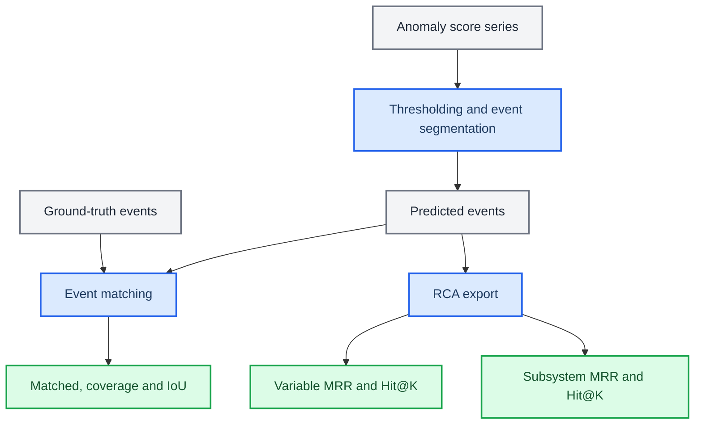

# 面向预测异常事件的工业控制系统源变量排序方法

## 摘要

工业控制系统中的多变量异常通常伴随快速传播，一个源变量的扰动可能通过工艺流程和控制逻辑影响多个下游变量，使“响应最强的变量”并不等同于“最应优先排查的源变量”。在异常检测器已经给出预测异常事件之后，变量级根因分析（root cause analysis, RCA）的关键问题不再是检测何时异常，而是在预测事件内部产生可审计的源变量排序。现有基于残差、z-score 或静态依赖图的排序方法容易放大传播响应变量；已有 SWaT/WADI RCA 文献虽提供了重要参照，但其事件窗口、标签映射和 top-K 协议与 predicted-event RCA 并不完全一致。本文提出 LaGraph-SB，一种面向预测异常事件的源变量排序框架。该框架以重构式时序建模产生异常事件，并在事件内联合残差、机制偏离、事件起始证据、源变量门控、传播抑制和事件特异性抑制构建变量级 RCA 分数。在 predicted-event variable-level RCA 协议下，LaGraph-SB 在 WADI 上达到 MRR 0.5960、Hit@1 0.5000、Hit@3 0.7143 和 Hit@5 0.7143；在 SWaT 上达到 MRR 0.5087、Hit@1 0.3939、Hit@3 0.5758 和 Hit@5 0.6667。相对于同协议下的随机排序、z-score、静态相关图和随机图传播基线，LaGraph-SB 在主要排序指标 MRR 和 Hit@1 上取得更高结果。本文的证据边界是 graph-guided source ranking：该方法不声称完成严格因果发现，也不将异常检测性能作为主贡献。

**Index Terms：** 工业控制系统；多变量时间序列；根因分析；源变量排序；图神经网络；可解释诊断

## I. 引言

工业控制系统、水处理和水分配系统通常由大量传感器、执行器和控制变量组成。这些变量不是独立观测量，而是受到工艺流程、物理连接、反馈控制和操作策略共同约束。异常事件一旦发生，多个变量可能在很短时间内同时偏离正常状态。对运维人员而言，仅知道系统进入异常状态并不足够；更有价值的问题是，在模型已经给出异常事件之后，哪些变量更应被优先检查。

现有多变量时间序列异常检测方法主要回答“何时异常”的问题。预测误差、重构误差、概率偏离和图传播分数能够为时间点或事件提供异常分数，但这些分数不能自然转化为可靠的变量级 RCA 排名。在工业过程中，下游响应变量往往比源变量具有更大的幅值偏移；如果直接按照残差或 z-score 排名，模型容易优先选择传播响应变量。这一失败模式在 SWaT 和 WADI 等水系统数据中尤其重要，因为攻击或故障会通过泵、阀门、液位和流量控制链路快速扩散。

这一问题已经在 SWaT/WADI RCA 文献中得到部分关注。REASON 和 CORAL 分别从离线和在线 RCA 角度在 SWaT/WADI 上报告了变量级定位结果，LEMMA-RCA 进一步把这两个数据集整理进 RCA benchmark。这些工作说明，SWaT/WADI 已经具备 RCA 研究基础；同时，它们也暴露了一个仍需明确处理的评价差异：许多已有结果使用离线或在线 RCA 设置，而实际部署中 RCA 排名往往需要从模型预测出的异常事件中产生。预测事件的边界偏移、事件覆盖不足和传播阶段混入都会影响变量排序，因此 predicted-event RCA 不能简单等同于在 oracle fault window 内做解释。

图结构模型为工业时间序列建模提供了有用工具。变量图能够刻画传感器之间的依赖关系，时序表示能够捕捉窗口内部动态，二者结合已被用于异常检测、解释和安全分析。然而，学习到的图边并不等价于物理因果边；即使图结构提升检测性能，也不能保证其解释结果对应真实根因。因此，本文不把图结构本身作为新颖性来源，而是将其限定为事件内排序证据：图结构只用于帮助区分源变量候选和传播响应变量，而不被解释为因果发现结果。

本文提出 LaGraph-SB。该方法基于一个明确但有边界的假设：工业异常事件通常表现为少数源变量先发生扰动，随后通过系统耦合引发多个变量响应。因此，RCA 排名不应把所有高响应变量都视为等价候选，而应通过源瓶颈机制提高少数源变量候选的优先级。LaGraph-SB 将事件内证据分解为残差、机制偏离、起始信号、源变量门控和传播惩罚，并在导出阶段加入事件特异性抑制，以降低跨事件通用响应变量的排名优势。

本文采用 predicted-event RCA 作为主评价协议。与 oracle true-event RCA 不同，predicted-event RCA 要求模型先根据异常分数产生预测事件，再在这些预测事件内进行变量级排序。实验主要使用 WADI 和 SWaT 的变量级 RCA 标签，并将 HAI 作为粗粒度补充验证。在这一设置下，本文作出如下贡献。

1. 本文将工业多变量异常诊断中的变量级 RCA 表述为预测事件内的源变量排序问题，明确区别于残差最大变量选择、异常检测性能评估和 oracle fault-window 解释。
2. 本文提出 LaGraph-SB，通过机制偏离、事件起始、源变量门控、传播抑制和事件特异性抑制构建变量级 RCA 分数，并明确每类证据能够支持和不能支持的结论。
3. 本文在 WADI 和 SWaT 上报告 predicted-event variable-level RCA 结果，并将同协议本地基线、外部同数据集背景结果和待补充复现实验分层区分，避免把不同协议下的跨论文数值写成严格优越性证据。
4. 本文明确方法边界：当前证据支持 graph-guided source ranking，但不足以支持严格因果发现或通用异常检测 SOTA 声明。

## II. 相关工作

### 2.1 工业控制系统中的变量级 RCA

SWaT 和 WADI 已经从异常检测数据集逐渐进入变量级 RCA 研究。REASON 在 KDD 2023 中提出 interdependent causal network，用于离线 root cause localization，并在 SWaT 和 WADI 上报告 PR@K、MAP@K 和 MRR [1]。CORAL 面向在线 RCA，通过增量因果图学习更新根因定位结果 [2]。LEMMA-RCA 将 SWaT 和 WADI 整理为 OT 场景下的 RCA benchmark，并系统评估 Dynotears、PC、C-LSTM、RCD、epsilon-Diagnosis、CIRCA、REASON 和 CORAL 等方法 [3]。这些工作是本文最接近的外部参照，因为它们与本文共享 SWaT/WADI 数据场景和变量级定位目标。

然而，这些工作与本文的评价假设并不相同。REASON 和 LEMMA-RCA 更接近 benchmark-style offline RCA，通常在给定故障片段或预定义事件的条件下评价变量排序；CORAL 强调在线图更新，但其 RCA 输出仍不等价于本文的 predicted-event ranking。本文的约束更接近部署链路：模型先产生预测事件，再在预测事件中导出变量排序。这个设置会引入事件覆盖、边界偏移和传播阶段混入等误差源。因此，本文不把跨论文数值写成严格比较，而将 REASON、CORAL 和 LEMMA-RCA 作为任务定位和后续复现实验的主要基线来源。

### 2.2 攻击归因和可解释异常检测

与 RCA 相邻的另一条研究线是 ICS anomaly attribution。NDSS 2024 的 Attributions for ML-based ICS Anomaly Detection 系统评估了 ML-based ICS 异常检测的变量归因能力，目标是识别被操纵的 sensor 或 actuator [4]。NOMS 2025 的 FM-based attack attribution 进一步在水系统中评估 attack attribution，并与 SHAP、LIME 和 LEMNA 等解释方法比较 [5]。这些工作与本文共享“异常后指出相关变量”的目标，但评价对象并不相同：attack attribution 更强调被操纵变量或攻击入口识别，而本文关注预测事件内部的 source-oriented RCA 排名。

反事实解释和异常修复也与本文相关。AR-Pro 在 SWaT、WADI 和 HAI 上研究带形式化性质的 counterfactual anomaly repair，说明反事实解释已成为工业异常诊断的重要方向 [6]。不过，反事实修复的目标是寻找能够使异常状态恢复或解释模型输出的干预，而不是直接优化变量级 MRR 或 Hit@K。因此，这类工作为本文提供解释性诊断背景，但不构成本文主表中的严格 RCA baseline。

### 2.3 图结构多变量时间序列建模

图神经网络和动态图学习已被广泛用于多变量时间序列异常检测。GDN 在 AAAI 2021 中使用图神经网络建模变量依赖关系，并在 SWaT/WADI 上进行异常检测 [7]；FuSAGNet 在 KDD 2022 中学习稀疏潜变量图表示，用于多变量时间序列异常检测 [8]。这些工作表明，SWaT/WADI 是图时序异常检测中的常用工业数据集，但它们主要评价检测性能或图表示质量。本文不把“使用图结构”作为贡献本身，而是考察图结构是否能在预测事件内帮助源变量排序。换言之，本文的关键问题不是图是否能提高异常分数，而是图证据是否能在异常传播后避免把下游响应变量误排为源变量。

## III. 方法

### 3.1 问题定义

设工业系统在时间点 \(t\) 的观测为 \(x_t \in \mathbb{R}^{C}\)，其中 \(C\) 表示变量数。给定长度为 \(L\) 的滑动窗口 \(X_{t-L+1:t} \in \mathbb{R}^{L \times C}\)，模型首先输出时间点异常分数 \(a_t\)，并通过阈值和事件切分得到预测异常事件集合 \(\hat{\mathcal{E}}\)。对每个预测事件 \(\hat e=[s_{\hat e}, q_{\hat e}]\)，变量级 RCA 的目标是输出变量排序 \(\pi_{\hat e}\)，使真实根因变量尽可能出现在排序前列。

本文区分 true-event RCA 和 predicted-event RCA。true-event RCA 在真实异常区间内进行排序，适合分析解释模块的上限；predicted-event RCA 则在模型预测事件内进行排序，更接近实际部署。本文以 predicted-event RCA 为主，因为它同时考察事件覆盖、事件边界和变量排序质量。

### 3.2 总体框架

LaGraph-SB 包含四个主要阶段。第一，模型从正常训练数据学习多变量窗口的重构模式，并生成时间点异常分数。第二，在预测事件内导出变量级证据，包括残差强度、机制偏离、事件起始证据、源变量门控和传播响应。第三，源瓶颈模块将多个异常变量压缩为少数更可能的源变量候选。第四，事件特异性抑制降低跨事件反复排名靠前的通用响应变量权重，得到最终变量级和子系统级 RCA 排序。

为避免把概念性解释误写成可复现算法，本文将 LaGraph-SB 明确限定为一个固定的事件内排序流程。所有证据分量在事件内归一化后聚合，分量权重和阈值在同一数据集的所有测试事件上保持固定，不使用 RCA 标签对单个事件进行调参。完整复现需要在附录中列出配置表；本节报告各模块在排序流程中的作用和证据边界。

```mermaid
flowchart LR
    accTitle: LaGraph SB Pipeline
    accDescr: The pipeline converts multivariate windows into predicted events and then ranks source-oriented root-cause variables inside each event.

    input_window["Multivariate window"] --> reconstruction["Reconstruction backbone"]
    reconstruction --> anomaly_score["Anomaly score"]
    anomaly_score --> predicted_event["Predicted event"]
    predicted_event --> evidence_export["Event-level evidence export"]
    evidence_export --> source_bottleneck["Source-bottleneck scoring"]
    source_bottleneck --> specificity["Event-specificity suppression"]
    specificity --> variable_rank["Variable RCA ranking"]
    specificity --> subsystem_rank["Subsystem RCA ranking"]

    classDef data fill:#f3f4f6,stroke:#6b7280,stroke-width:2px,color:#1f2937
    classDef model fill:#dbeafe,stroke:#2563eb,stroke-width:2px,color:#1e3a5f
    classDef output fill:#dcfce7,stroke:#16a34a,stroke-width:2px,color:#14532d

    class input_window,predicted_event data
    class reconstruction,evidence_export,source_bottleneck,specificity model
    class anomaly_score,variable_rank,subsystem_rank output
```



**Fig. 1. LaGraph-SB 方法概览。** 模型先从多变量窗口中产生异常分数和预测事件，再在预测事件内聚合变量级证据，经过源瓶颈评分和事件特异性抑制后输出 RCA 排序。

### 3.3 事件内变量证据

LaGraph-SB 不把单一残差作为根因分数。对事件 \(\hat e\) 和变量 \(i\)，模型导出多类互补证据。残差证据刻画变量在事件内偏离重构模式的程度。机制偏离证据刻画变量与其通道邻域之间的正常解释关系是否被破坏。事件起始证据强调变量是否在事件早期出现异常信号。源变量门控证据用于估计变量作为事件源头的可能性。传播响应证据则用于降低那些虽然响应强烈但更可能处于下游传播位置的变量排名。

概念上，变量级 RCA 分数可以写作：

```text
score_i(e) =
    residual_i(e)
  + mechanism_i(e)
  + onset_i(e)
  + source_gate_i(e)
  - propagation_i(e)
  - specificity_i(e)
```

该表达式用于说明证据结构，而不是固定实现公式。实际实现中的归一化方式、权重和事件聚合策略以实验配置为准。本文在表述上避免将各分量解释为独立因果效应，而将其视为 source-oriented RCA 的互补证据。

| 证据分量 | 作用 | 不能支持的结论 |
|---|---|---|
| residual | 衡量变量在预测事件内的异常响应强度 | 不能单独证明该变量是源头 |
| mechanism | 衡量变量与通道邻域的正常解释关系是否被破坏 | 不能等同于物理因果边 |
| onset | 强调事件早期出现异常的变量 | 不能排除迟发源变量或控制延迟 |
| source_gate | 提高少数源变量候选的排序权重 | 不是经过干预验证的因果门控 |
| propagation | 降低下游响应变量的排序优先级 | 不能完整重建传播路径 |
| specificity | 降低跨事件高频响应变量权重 | 属于导出阶段校准，不是端到端训练证据 |

### 3.4 源瓶颈评分

源瓶颈模块的设计动机是异常传播的稀疏源假设：一个事件可以影响许多变量，但更接近事件起点的变量通常较少。普通残差排序会扩大响应变量的影响，普通稀疏化又可能只压低候选数量而不改变源/响应区分。源瓶颈评分的目标是在保留事件解释能力的同时，提高少数源变量候选的排序权重，并降低下游响应变量的优先级。

这一设计对应工业排查流程。运维人员通常不会同时检查所有高残差变量，而是希望先获得少量高置信变量，再根据工艺连接和响应路径进行排查。源瓶颈因此不是单纯的正则化技巧，而是把工业 RCA 的排查需求转化为排序约束。

### 3.5 事件特异性抑制

在 WADI 实验中，一些变量会在多个预测事件中反复取得高排名。这类变量可能是高敏感响应通道或公共传播变量，而不一定是每个事件的根因。事件特异性抑制针对这一问题，对跨事件高频进入 top-1 的变量施加惩罚。其核心思想是：真正的根因变量应当对当前事件具有相对特异性，而不是在大量无关事件中都占据最高排名。

当前实现将事件特异性抑制作为无标签导出阶段约束。它不手工指定特定变量，也不使用测试标签调整变量排名。在 WADI 上，该策略将 source-bottleneck-balanced 的变量级 MRR 从 0.5268 提升到 0.5960，并将 Hit@1 从 0.3571 提升到 0.5000；在 SWaT 上，该条件未触发，主线结果保持不变。这个设计的审稿风险在于，如果 top-1 频率由完整测试批次统计得到，它更接近 batch-level calibration；在线部署时应只能使用历史预测事件更新频率。因此，本文将 specificity 作为导出阶段证据，而不是端到端学习贡献。后续实验需要补充 no-specificity 消融、seed 稳定性，以及只使用过去事件更新频率的在线版本。

### 3.6 分层 RCA 输出与评价

工业诊断通常先定位工艺区域，再定位具体变量。因此，LaGraph-SB 同时输出变量级和子系统级排序。变量级排序是本文主任务，用于评估模型是否找到具体根因变量；子系统级排序用于评估模型是否至少定位到正确工艺区域。本文主要报告 MRR 和 Hit@K，并在补充实验中报告 MAP@K、NDCG@K、事件匹配率、覆盖率和 IoU。



**Fig. 2. predicted-event RCA 评价协议。** 模型先产生预测事件，再在预测事件内导出 RCA 排序。该协议避免只在真实事件窗口内评价解释模块，从而更接近部署场景。

## IV. 实验设置

### 4.1 数据集

本文以 WADI 和 SWaT 作为变量级 RCA 主数据集。二者均来自水系统工业控制场景，包含传感器、执行器和控制变量，并提供攻击或异常事件信息。HAI 用作补充数据集，主要验证粗粒度子系统定位，不与 WADI/SWaT 放入同一个变量级主表。

| 数据集 | 系统类型 | 本文角色 | RCA 粒度 |
|---|---|---|---|
| WADI | 水分配系统 | 主实验 | 变量级与子系统级 |
| SWaT | 水处理系统 | 主实验 | 变量级与子系统级 |
| HAI | 工业控制仿真平台 | 补充实验 | 主要为子系统级 |

### 4.2 指标

变量级 RCA 以 MRR、Hit@1、Hit@3 和 Hit@5 为主。MRR 衡量真实根因在排序中的平均倒数名次，Hit@K 衡量真实根因是否进入前 \(K\) 个候选。由于不同论文中的 PR@K、AC@K、HitRate@P% 和 Hit@K 定义并不完全一致，本文只在同协议实验中使用它们作严格比较；跨论文结果仅作为背景定位。

### 4.3 对比方法

当前同协议基线包括随机变量排序、z-score 变量偏离、静态相关图、随机图传播、soft-hierarchical RCA 和 source-bottleneck-balanced。随机排序给出任务下限，z-score 检验简单统计偏离是否足以解释根因，静态相关图和随机图传播检验图结构本身是否产生有效 RCA，soft-hierarchical RCA 和 source-bottleneck-balanced 则用于评估 LaGraph 内部架构演进。

为便于与已有 SWaT/WADI RCA 文献对齐，本文还整理了 REASON、CORAL 以及 LEMMA-RCA 中若干 baseline 的公开结果。该比较不作为严格 superiority claim，因为这些方法的事件协议和 top-K 指标定义与本文不同。后续补充实验将优先把 REASON/CORAL/LEMMA-RCA-style baseline 迁移到本文的 predicted-event RCA 协议下。

### 4.4 证据分层

本文将实验结论分为三个证据等级。第一类是严格同协议证据，即在相同预测事件、相同 RCA 标签映射和相同指标计算下得到的本地基线比较，这类结果用于支撑主要结论。第二类是同数据集背景证据，即 REASON、CORAL 和 LEMMA-RCA 等公开 SWaT/WADI 结果，这类结果用于说明本文数值所处区间，但不用于声称严格优越。第三类是待补强证据，包括外部 RCA baseline 的统一协议复现、seed 稳定性、核心模块消融和事件级案例分析。本文在结果部分只把第一类证据作为主要判断依据。

## V. 结果

### 5.1 LaGraph-SB 在主要变量级排序指标上优于当前同协议基线

WADI 和 SWaT 的主结果表明，变量级源变量排序不能由简单统计偏离充分解释。在 WADI 上，z-score baseline 的 MRR 为 0.1934，Hit@1 为 0.0714；随机排序 MRR 为 0.2917；source-bottleneck-specificity 将 MRR 提升到 0.5960，将 Hit@1 提升到 0.5000。在 SWaT 上，z-score baseline 的 MRR 为 0.3201，Hit@1 为 0.1515；source-bottleneck-specificity 达到 MRR 0.5087 和 Hit@1 0.3939。需要注意的是，SWaT 的 soft-hierarchical-rca 在 Hit@3 和 Hit@5 上仍然较强，因此本文的主结果应表述为 MRR 和 Hit@1 的改进，而不是所有 top-K 指标的全面优势。

**TABLE I. predicted-event 变量级 RCA 主结果。**

| 数据集 | 方法 | Matched | MRR | Hit@1 | Hit@3 | Hit@5 |
|---|---|---:|---:|---:|---:|---:|
| WADI | z-score baseline | N/A | 0.1934 | 0.0714 | 0.1429 | 0.4286 |
| WADI | random baseline | N/A | 0.2917 | 0.1186 | 0.3103 | 0.4816 |
| WADI | soft-hierarchical-rca | 1.0000 | 0.4507 | 0.3571 | 0.5000 | 0.5714 |
| WADI | source-bottleneck-balanced | 1.0000 | 0.5268 | 0.3571 | 0.6429 | 0.7143 |
| WADI | source-bottleneck-specificity | 1.0000 | 0.5960 | 0.5000 | 0.7143 | 0.7143 |
| SWaT | random channel mean | 0.9394 | 0.1066 | 0.0271 | 0.0795 | 0.1338 |
| SWaT | random graph prior | 0.9394 | 0.2731 | 0.1212 | 0.3030 | 0.3636 |
| SWaT | z-score baseline | 0.9394 | 0.3201 | 0.1515 | 0.4242 | 0.4848 |
| SWaT | correlation prior | 0.9394 | 0.2550 | 0.1212 | 0.2727 | 0.2727 |
| SWaT | soft-hierarchical-rca | N/A | 0.4908 | 0.3333 | 0.6061 | 0.6970 |
| SWaT | source-bottleneck-specificity | 0.9394 | 0.5087 | 0.3939 | 0.5758 | 0.6667 |

注：N/A 表示该行尚未按当前 predicted-event matched 协议统一重算。该表中 matched 已统一统计的行可作为严格同协议比较；N/A 行目前用于显示相同评价脚本下的排序数值，后续需补齐 matched 后再进入最终主表。

这些结果支持本文的主要判断：变量级 RCA 需要区分源变量和传播响应变量，不能只依赖异常幅值或静态相关结构。尤其在 SWaT 上，z-score 和 correlation prior 的 Hit@1 分别只有 0.1515 和 0.1212，而 LaGraph-SB 达到 0.3939，说明模型学到的不只是高偏离变量排序。与此同时，SWaT 的 Hit@3/Hit@5 结果提示当前方法仍可能把部分真实源变量排在前五名之外，后续案例分析需要解释这些失败事件。

### 5.2 事件特异性抑制主要改善 WADI 源变量排序

事件特异性抑制对 WADI 的提升最明显。与 source-bottleneck-balanced 相比，加入 specificity 后 WADI MRR 从 0.5268 提升到 0.5960，Hit@1 从 0.3571 提升到 0.5000。15 epoch 结果保持相近的变量级排序能力，MRR 为 0.5873。SWaT 中 specificity 条件未触发，因此结果与 source-bottleneck-balanced 保持一致。

**TABLE II. 事件特异性抑制的当前证据。**

| 数据集 | 方法 | Epoch | Specificity | MRR | Hit@1 | Hit@3 | Hit@5 |
|---|---|---:|---|---:|---:|---:|---:|
| WADI | source-bottleneck-balanced | 8 | no | 0.5268 | 0.3571 | 0.6429 | 0.7143 |
| WADI | source-bottleneck-specificity | 8 | yes | 0.5960 | 0.5000 | 0.7143 | 0.7143 |
| WADI | source-bottleneck-specificity | 15 | yes | 0.5873 | 0.5000 | 0.7143 | 0.7143 |
| SWaT | source-bottleneck-balanced | 8 | no | 0.5087 | 0.3939 | 0.5758 | 0.6667 |
| SWaT | source-bottleneck-specificity | 8 | no | 0.5087 | 0.3939 | 0.5758 | 0.6667 |

该结果表明，跨事件高频响应变量可能影响 WADI 的源变量排序。事件特异性抑制为这一问题提供了一个可解释的导出阶段修正，但目前证据仍不足以证明它是普适机制。它应被视为当前主线中的一个受限组件，后续需要通过 no-specificity 消融、跨 seed 稳定性和仅使用历史事件的在线版本进一步验证。

### 5.3 子系统级定位支持分层诊断，但不能替代变量级结论

子系统级定位比变量级定位更容易，因为多个变量可以映射到同一工艺区域。WADI 上 z-score 子系统 MRR 已达到 0.7679，说明粗粒度区域定位可以被简单统计偏离部分解决。因此，本文将子系统级结果作为分层诊断证据，而不是主贡献。

**TABLE III. 子系统级 RCA 摘要。**

| 数据集 | 方法 | Matched | Subsystem MRR | Hit@1 | Hit@3 | Hit@5 |
|---|---|---:|---:|---:|---:|---:|
| WADI | random baseline | N/A | 0.4049 | 0.1606 | 0.5006 | 0.8299 |
| WADI | z-score baseline | N/A | 0.7679 | 0.5714 | 0.9286 | 1.0000 |
| WADI | source-bottleneck-specificity | N/A | 0.7917 | 0.6429 | 0.9286 | 1.0000 |
| SWaT | random group mean | 0.9118 | 0.1542 | 0.0421 | 0.1302 | 0.2172 |
| SWaT | z-score baseline | 0.9118 | 0.5296 | 0.3235 | 0.6765 | 0.7941 |
| SWaT | source-bottleneck-specificity | 0.9394 | 0.8102 | 0.7097 | 0.9032 | 0.9677 |
| HAI | mechanism-root-sharp-rca | 1.0000 | 0.9111 | 0.8367 | 1.0000 | 1.0000 |

注：N/A 表示该行尚未按当前 predicted-event matched 协议统一重算。

SWaT 的子系统结果显示 LaGraph-SB 高于 z-score 和随机组排序；WADI 的子系统提升较小，但变量级提升更清楚。这一差异进一步支持本文的实验重心：粗粒度区域定位可以作为辅助证据，变量级根因排序才是更能体现方法价值的任务。

### 5.4 与 SWaT/WADI RCA 文献的背景对齐

已有 SWaT/WADI RCA 工作提供了外部参照。REASON 在 KDD 2023 中报告 SWaT MRR 0.4099、WADI MRR 0.5335 [1]；CORAL 报告 SWaT MRR 0.317、WADI MRR 0.519 [2]。LEMMA-RCA 进一步汇总了 CIRCA、RCD、C-LSTM、PC 和 Dynotears 等 baseline [3]。LaGraph-SB 当前在 SWaT 和 WADI 上的 MRR 分别为 0.5087 和 0.5960，数值高于这些公开结果。

**TABLE IV. SWaT/WADI RCA 相关文献的背景对齐。**

| 方法 | 来源 | 任务设置 | SWaT MRR | WADI MRR | 比较性质 |
|---|---|---|---:|---:|---|
| REASON | KDD 2023 | offline RCA | 0.4099 | 0.5335 | 同数据集，协议不同 |
| CORAL | KDD 2023 | online RCA | 0.3170 | 0.5190 | 同数据集，协议不同 |
| CIRCA | LEMMA-RCA baseline | offline RCA | 0.2870 | 0.3500 | 同数据集，协议不同 |
| RCD | LEMMA-RCA baseline | offline RCA | 0.2280 | 0.2640 | 同数据集，协议不同 |
| C-LSTM | LEMMA-RCA baseline | Granger-style RCA | 0.2940 | 0.2440 | 同数据集，协议不同 |
| Dynotears | LEMMA-RCA baseline | dynamic DAG RCA | 0.2790 | 0.2220 | 同数据集，协议不同 |
| LaGraph-SB | 本文 | predicted-event RCA | 0.5087 | 0.5960 | 本文协议 |

该表只能作为背景对齐，而不能作为严格 SOTA 排名。原因有三点。第一，REASON、CORAL 和 LEMMA-RCA 的事件划分、标签映射和 top-K 评价方式与本文不同。第二，部分文献使用 PR@K 或 AC@K，而本文主表使用 Hit@K 和 MRR。第三，本文的 predicted-event RCA 会受到检测事件边界影响，而 offline RCA 通常使用更接近 oracle 的事件窗口。尽管如此，该对齐仍说明 LaGraph-SB 的变量级 MRR 处在 SWaT/WADI RCA 文献中的有竞争力区间。

### 5.5 负向实验约束了方法主张

在架构探索中，若干看似合理的设计并未稳定提升变量级 RCA。静态相关先验不能直接替代源变量排序，额外 RCA head 容易引入校准不足，WADI-only scoring search 虽可在单一数据集上取得更高 MRR，但会损害 SWaT 表现，因此不适合作为统一方法。更深的 channel-temporal co-refinement 能强化图耦合叙事，却没有超过 source-bottleneck-specificity 的变量级 RCA。

**TABLE V. 负向或次要架构尝试。**

| 方向 | 观察 | 当前处理 |
|---|---|---|
| source-innovation | WADI MRR 从 0.4693 降到 0.4316 | 不作为主模块 |
| source-effect RCA head | WADI MRR 降到 0.4583 | 放入附录或消融 |
| WADI-only scoring search | WADI 可到 MRR 0.7401，但 SWaT 降到 0.4281 | 不采用数据集特定规则 |
| source-bottleneck-corefine | 图耦合更深但变量级 RCA 弱于主线 | 作为负向实验 |
| 强因果或 lagged causal prior | 指标不稳定 | 不声称因果发现 |

这些结果限制了本文的主张范围。LaGraph-SB 的贡献不是模块堆叠，而是在多组候选设计中保留了对变量级 source localization 稳定有效的源瓶颈和事件特异性机制。

## VI. 讨论

本文结果支持一个有边界的结论：在工业控制系统异常事件中，变量级 RCA 需要显式区分源变量和传播响应变量。LaGraph-SB 通过源瓶颈和事件特异性抑制将“许多变量同时异常”的现象转化为“少数变量更可能解释事件源头”的排序问题。在 WADI 和 SWaT 上，该方法在主要排序指标上优于当前同协议的简单统计、随机排序和静态图基线，说明变量级源变量排序不能被残差幅值或相关图传播完全解释。

与已有图异常检测方法相比，本文的重点不在于提出更复杂的图结构，而在于让图结构服务于 RCA。通道图和时序重构用于提供机制感知证据，源瓶颈用于约束源变量候选，事件特异性抑制用于降低跨事件通用响应变量的影响。这种定位避免将 learned graph 过度解释为因果图，也更符合当前实验能够支持的证据边界。

本文仍有明显局限。第一，外部强 RCA baseline 尚未在本文 predicted-event 协议下复现，因此与 REASON、CORAL 和 LEMMA-RCA baseline 的比较仍属于背景对齐。第二，事件特异性抑制目前是导出阶段约束，还需要训练期正则化版本和 no-specificity 消融验证。第三，当前结果主要来自 WADI 和 SWaT，HAI 只提供粗粒度补充证据。第四，predicted-event RCA 依赖异常事件切分，如果事件边界偏移较大，根因排序可能混入更多传播阶段变量。

后续实验应优先补齐三类证据。首先，将 REASON-style propagation、CIRCA/RCD-style causal ranking、PC/C-LSTM/Dynotears 等基线迁移到本文 predicted-event 协议下。其次，报告 seed 稳定性、epoch 稳定性和核心模块消融，特别是 no source gate、no bottleneck、no propagation suppression 和 no event-specificity。最后，增加事件级案例图，展示残差排序、源瓶颈排序、真实根因和传播变量之间的差异。

## VII. 结论

本文提出 LaGraph-SB，一种面向工业控制系统多变量时间序列异常的源变量排序方法。该方法将变量级 RCA 建模为源变量和传播响应变量的区分问题，并通过事件内多证据融合、源瓶颈评分和事件特异性抑制输出 predicted-event 根因排序。

在 WADI 和 SWaT 上，LaGraph-SB 分别达到变量级 MRR 0.5960 和 0.5087，并在 MRR 和 Hit@1 上优于当前同协议下的随机、z-score、静态相关图和随机图传播基线。子系统级结果进一步说明该方法能够提供分层诊断信息，但变量级 RCA 仍是本文主证据。与已有 SWaT/WADI RCA 文献相比，当前结果处于有竞争力区间；严格的 SOTA 声明仍需要统一协议下的外部 baseline 复现。

## 参考文献

[1] REASON: Interdependent Causal Networks for Root Cause Localization. KDD 2023. https://nijingchao.github.io/paper/kdd23_reason.pdf

[2] CORAL: Incremental Causal Graph Learning for Online Root Cause Analysis. KDD 2023. https://doi.org/10.1145/3580305.3599392

[3] LEMMA-RCA: A Large Multi-modal Multi-domain Dataset for Root Cause Analysis. 2024. https://openreview.net/pdf?id=0R8JUzjSdq

[4] Attributions for ML-based ICS Anomaly Detection: From Theory to Practice. NDSS 2024. https://www.ndss-symposium.org/ndss-paper/attributions-for-ml-based-ics-anomaly-detection-from-theory-to-practice/

[5] Enhancing Network Security Management in Water Systems using FM-based Attack Attribution. NOMS 2025. https://arxiv.org/abs/2503.01229

[6] AR-Pro: Counterfactual Explanations for Anomaly Repair with Formal Properties. NeurIPS 2024. https://proceedings.neurips.cc/paper_files/paper/2024/hash/1d3591b6746204b332acb464b775d38d-Abstract-Conference.html

[7] Graph Neural Network-Based Anomaly Detection in Multivariate Time Series. AAAI 2021. https://cdn.aaai.org/ojs/16523/16523-13-20017-1-2-20210518.pdf

[8] Learning Sparse Latent Graph Representations for Anomaly Detection in Multivariate Time Series. KDD 2022. https://doi.org/10.1145/3534678.3539117

## 作者待补清单（不进入投稿正文）

1. 复现或近似复现 REASON/CORAL/LEMMA-RCA 中 2-3 个外部 RCA baseline 到 predicted-event 协议下。
2. 补齐 residual-only、forecast-error-only、no source gate、no bottleneck、no propagation suppression、no event-specificity 消融。
3. 补充 3-5 个随机种子的 MRR/Hit@K 均值和置信区间。
4. 生成至少三个事件级案例图：WADI 成功案例、SWaT 成功或近失误案例、失败案例。
5. 将 Mermaid 图 1 和图 2 转为投稿图，或用绘图工具重绘为多面板示意图。
6. 将参考文献条目转换为目标期刊要求的 BibTeX 或 CSL 格式。
