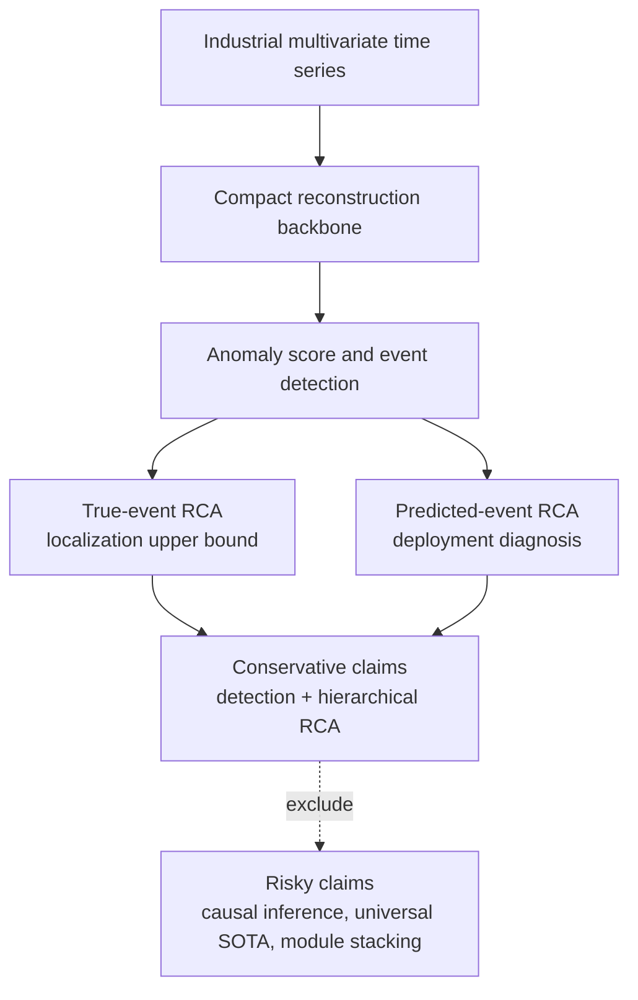

# Paper Review Risk and System Scope

Date: 2026-05-26
Branch: `codex/5070-env-migration`

## Purpose

This document is a reviewer-facing decision filter for LaGraph. Its goal is to
prevent the project from drifting into a module-stacking system that is hard to
defend in a paper.

The current paper should be framed as:

```text
Industrial multivariate anomaly detection with hierarchical root-cause
localization and local counterfactual attribution.
```

It should not be framed as:

```text
A universal SOTA detector with fully causal root-cause inference.
```

The second claim is not supported by the current evidence.

## Reviewer First Questions

| Reviewer question | Current risk | Required answer |
| --- | --- | --- |
| Is the method just a stack of modules? | High | Define one compact main architecture and move unproven profiles to ablation/future work. |
| Does the dual graph actually improve results? | High | Do not claim universal dual-graph superiority. Use ablations to show what each graph contributes and where it fails. |
| Is the RCA causal? | High | Do not call it causal inference unless intervention or validated temporal-causal assumptions are added. Use "local counterfactual attribution" instead. |
| Is RCA evaluated using true anomaly intervals? | Medium | Report both true-event RCA and predicted-event RCA. True-event RCA is localization upper bound; predicted-event RCA is deployment-oriented. |
| Is threshold selection cherry-picked? | High | Report threshold sensitivity. Use fixed threshold keys or validation-derived rules, not post-hoc best test values. |
| Is subsystem-level RCA too coarse? | Medium | State the target as hierarchical RCA: subsystem first, channel ranking as explanation. Do not claim exact actuator-level RCA without labels. |
| Does local contrast simply reproduce z-score? | Medium | Compare against train-normal z-score and raw reconstruction contribution. Report where local contrast changes ranking. |
| Are industrial claims supported? | Medium | Use HAI/TE as industrial-style evidence, but avoid overclaiming general industrial deployment until more datasets are tested. |
| Are weak raw F1 results hidden? | High | Report raw F1 transparently. Use adjusted/Affiliation F1 only as event-level complements, not replacements. |
| Is the method reproducible? | Medium | Freeze main profile, seeds, threshold protocol, and RCA evaluation scripts. |

## Final Paper Scope

### Main System

The main paper system should contain only the components below.

| Component | Paper status | Reason |
| --- | --- | --- |
| MoE decomposition | Main | Simple reconstruction backbone; easy to explain. |
| Channel adaptive graph | Main | Directly supports multivariate dependency and subsystem RCA narrative. |
| Stable temporal graph | Main | Temporal refinement, but do not overclaim independent superiority. |
| Dual-path VQ regularization | Main or secondary | Retain only as normal-pattern regularization; do not claim VQ score is the main detector. |
| EncoderStack | Main | Compact temporal representation module. |
| Direct reconstruction score | Main | Stable and explainable anomaly score. |
| Local-contrast RCA | Main RCA contribution | Clear formula, interpretable, improves ranking order. |
| Predicted-event RCA evaluation | Main evaluation contribution | Addresses deployment realism and avoids interval-leakage criticism. |

### Ablation or Appendix Only

| Component/profile | Status | Reason |
| --- | --- | --- |
| Dynamic temporal graph | Appendix | Useful but not uniformly better than `full`. |
| State-aware fusion | Future/appendix | Conceptually interesting, but currently under-validated. |
| Graph-propagated RCA | Appendix/future | Implemented, but no stable subsystem-level gain. |
| Lagged causal branch | Future work | Cannot be called causal without stronger validation. |
| Synthetic anomaly auxiliary head | Appendix/future | Extra complexity; needs dedicated evidence. |
| Robust losses and temporal-diff losses | Appendix | Mixed or negative results. |
| Event-affinity post-processing profiles | Appendix | Risk of metric tuning; not a core method. |
| Direct VQ score fusion | Rejected ablation | Not consistently useful. |
| Multi-scale/VQ scorer path | Rejected ablation | Less stable than direct reconstruction scoring. |

### Do Not Claim

These claims should not appear in the main paper unless new evidence is added.

1. LaGraph performs true causal inference.
2. The dual graph is always better than single-graph variants.
3. The method is SOTA on all metrics.
4. Predicted-event RCA with one selected threshold is the only valid deployment result.
5. HAI subsystem RCA proves exact variable-level root cause localization.
6. More modules make the method more interpretable.

## Defensible Contribution Set

The paper should use three contributions.

### Contribution 1: Compact Dual-Graph Reconstruction Backbone

Claim level: moderate.

Defensible wording:

```text
We introduce a compact reconstruction backbone that combines cross-channel
dependency modeling with temporal refinement for multivariate industrial time
series.
```

Do not write:

```text
The dual graph consistently outperforms all single-graph variants.
```

Required evidence:

- `full` vs `reconstruction`;
- `full` vs `channel-only`;
- `full` vs `temporal-only`;
- `full` vs `no-vq`;
- parameter count and runtime.

### Contribution 2: Local Counterfactual RCA

Claim level: strong enough for main paper if presented carefully.

Formula:

```text
RCA_i = E_i(event)
      + alpha * max(E_i(event) - E_i(pre-event baseline), 0)
```

where `E_i` is channel-wise reconstruction contribution and `alpha = 0.75` in
the current HAI experiments.

Defensible wording:

```text
The local contrast term highlights variables whose reconstruction contribution
increases relative to the immediately preceding operating context, which is a
simple local counterfactual baseline for industrial diagnosis.
```

Do not write:

```text
The local contrast term identifies the true causal root variable.
```

Required evidence:

- LaGraph raw RCA vs LaGraph-local-contrast;
- z-score RCA baseline;
- random ranking baseline with repeated trials;
- case study where local contrast changes a multi-root ranking;
- subsystem-level and channel-level ranked examples.

### Contribution 3: Two-Level RCA Evaluation Protocol

Claim level: strong as evaluation contribution.

The two protocols:

| Protocol | Meaning | Risk controlled |
| --- | --- | --- |
| True-event RCA | Localization ability when event interval is known | Isolates attribution quality. |
| Predicted-event RCA | End-to-end deployment diagnosis | Penalizes missed detections and delay. |

Defensible wording:

```text
We report both event-conditioned RCA and predicted-event RCA. The latter
evaluates whether the detector both covers the event and ranks the correct
subsystem.
```

Do not write:

```text
The RCA module is evaluated independently of detection errors.
```

Required evidence:

- true-event RCA table;
- predicted-event RCA table;
- threshold sensitivity;
- RCA_Delay@K.

## Current Evidence Summary

### True-Event RCA

HAI subsystem-level RCA, averaged across five HAI test files:

| Method | MRR | Hit@1 | NDCG@3 | NDCG@5 |
| --- | ---: | ---: | ---: | ---: |
| LaGraph-local-contrast | 0.9867 | 0.9733 | 0.9462 | 0.9717 |
| LaGraph raw RCA | 0.9867 | 0.9733 | 0.9275 | 0.9680 |
| z-score | 0.9667 | 0.9433 | 0.9299 | 0.9554 |
| random | 0.5924 | 0.3386 | 0.5759 | 0.6917 |

Interpretation:

- The local contrast term improves ranking order, especially NDCG@3.
- It does not improve average Hit@1 over raw LaGraph.
- The improvement is useful but not a decisive breakthrough.

### Predicted-Event RCA

HAI predicted-event RCA, averaged across five HAI test files:

| Prediction key | matched | MRR | Hit@1 | NDCG@3 | NDCG@5 | RCA_Delay@1 |
| ---: | ---: | ---: | ---: | ---: | ---: | ---: |
| 2 | 0.9900 | 0.9375 | 0.8933 | 0.8860 | 0.9308 | 18.40 |
| 5 | 1.0000 | 0.9425 | 0.8933 | 0.8846 | 0.9338 | 18.00 |
| 1.0 | 0.9800 | 0.9275 | 0.8833 | 0.8760 | 0.9208 | 19.62 |
| 0.5 | 0.9600 | 0.9275 | 0.9000 | 0.8709 | 0.9157 | 23.52 |
| pot | 0.8867 | 0.8617 | 0.8367 | 0.8321 | 0.8514 | 24.43 |

Interpretation:

- Predicted-event RCA is mostly limited by event coverage.
- `prediction_key=2` is the best current NDCG@3 and delay balance.
- `prediction_key=5` has full event coverage but likely higher false-positive cost.
- The paper should report threshold sensitivity instead of hiding this tradeoff.

## Paper Narrative Diagram



## Reviewer Response Map

| If reviewer says... | Response |
| --- | --- |
| "This is not causal." | Agree. The method is local counterfactual attribution, not causal identification. Causal learning is future work. |
| "RCA uses true anomaly intervals." | Report predicted-event RCA as the deployment metric; true-event RCA is only an upper-bound attribution analysis. |
| "Dual graph is not consistently better." | Do not claim universal superiority. Present ablations and frame the channel graph as structural support for diagnosis. |
| "Thresholds are tuned to test data." | Use threshold sensitivity tables. If a single threshold is reported, define it before testing or choose from validation. |
| "Subsystem RCA is too easy." | State it as first-stage hierarchical RCA and include channel rankings as qualitative explanation, not variable-level ground truth. |
| "z-score is competitive." | Keep z-score as a strong baseline and emphasize the incremental value of local context and predicted-event evaluation. |
| "The architecture is too complex." | Main profile is compact; other profiles are not part of the main method. |

## Go/No-Go Rules for Future Changes

A future module can enter the main paper only if all conditions are met:

1. It has a one-sentence physical or diagnostic interpretation.
2. It improves at least one primary metric without degrading the main table.
3. It beats a simple baseline, not only a weak random baseline.
4. Its ablation is clean and reproducible.
5. It does not require dataset-specific test-set tuning.
6. It can be visualized or explained in a single figure.

If any condition fails, the module stays in appendix or future work.

## Recommended Next Experiments

### Required

1. Freeze the main architecture as `full` plus local-contrast RCA.
2. Run complete detection tables with transparent raw F1, adjusted F1, Affiliation F1, AUROC, and AUPRC.
3. Run final HAI RCA tables:
   - true-event RCA;
   - predicted-event RCA;
   - z-score and random baselines.
4. Add 2-3 case studies:
   - one successful single-root case;
   - one successful multi-root case;
   - one failure case.

### Optional

1. Channel-only multi-seed stability check.
2. TE qualitative RCA visualization.
3. Runtime and parameter-count comparison.

### Avoid for Now

1. Adding new causal modules.
2. Adding new graph-fusion modules.
3. Optimizing thresholds only for RCA.
4. Claiming variable-level RCA without labels.

## Final Recommendation

The paper should stop expanding the system and converge on this thesis:

```text
LaGraph is a compact industrial anomaly diagnosis framework that combines
reconstruction-based detection with hierarchical RCA. Its main contribution is
not a large detector, but a reviewer-transparent diagnosis protocol and a local
counterfactual attribution score that improves subsystem ranking while remaining
simple enough to audit.
```
