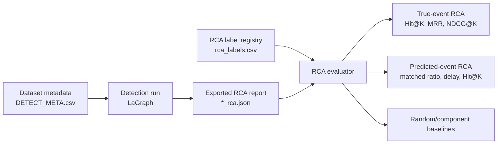

# RCA Evaluation Protocol

This document fixes the current experimental boundary for LaGraph's paper
direction. The goal is to avoid mixing pure anomaly detection benchmarks with
datasets that can support root-cause analysis (RCA).

## Dataset Roles

| Dataset | Current role | RCA status | Decision |
|---|---|---|---|
| HAI 21.03 test1-test5 | Main industrial RCA benchmark | Registered subsystem labels from `attack_P1/P2/P3` | Use for detection, predicted-event RCA, and graph faithfulness |
| SWaT A1/A2 (`swat.csv`) | Legacy attack-only industrial validation | 34 verified events reconciled from `List_of_attacks_Final.xlsx`; 1 binary-label segment has no overlapping physical-attack row | Keep for comparability with earlier experiments |
| SWaT A1/A2 Physical (`SWAT_A1A2_Physical_v1.csv`) | Main SWaT industrial detection+RCA benchmark | Official `Normal_v1` training segment plus `Attack_v0` test segment; 34 verified RCA events | Prefer for new SWaT experiments because it preserves the official normal/attack split |
| SWaT A6 2019 | Supplemental process-disruption stress test | Log-derived process attack intervals available; target tags are not specified | Use only as supplemental detection/robustness evidence, not as verified RCA benchmark |
| TE-MM | Process fault generalization | Fault-file to IDV mapping needs confirmation | Keep detection; add process-unit RCA only after mapping is verified |
| WADI A2 2019 | Industrial validation candidate | Raw data and attack-description PDF available; target mapping needs verification | Use `WADI_A2_2019_ds10.csv` for detection smoke tests; add RCA after attack descriptions are reconciled with converted event indices |
| MSL | Removed from active suite | Weak RCA ground truth for this paper's claim | Do not use in main experiments |
| SMD | Removed from active suite | Large and not aligned with current industrial RCA story | Do not use in main experiments |

## Unified Label Registry

The canonical RCA label file is:

```text
D:\la_v12\dataset\anomaly_detect\rca_labels.csv
```

Schema:

```text
dataset,file,event_id,event_start,event_end,subsystem_root,variable_roots,granularity,task,time_index,source
```

Only labels with an inspectable source should enter this file. Unsupported
datasets should remain absent rather than being assigned guessed roots.

## Evaluation Flow



## Predicted-Event Matching

Predicted-event RCA uses two levels of event matching.

The legacy lenient match remains:

```text
matched = 1 if overlap(predicted_event, true_event) > 0
```

This matches common event-hit practice but is optimistic when predicted events
touch a true event by only one time point. New RCA tables therefore also report:

```text
true_coverage = |P ∩ G| / |G|
pred_coverage = |P ∩ G| / |P|
event_iou = |P ∩ G| / |P ∪ G|
matched_coverage_10 = 1[true_coverage >= 0.10]
matched_iou_10 = 1[event_iou >= 0.10]
matched_iou_30 = 1[event_iou >= 0.30]
```

Main predicted-event RCA tables may still include the lenient `matched` column
for comparability with previous results, but conclusions should be checked
against `matched_coverage_10` or `matched_iou_10` when arguing end-to-end RCA
quality.

## Current Strict Claim Boundary

The current defensible claim is:

```text
LaGraph provides competitive industrial anomaly detection and reliable
subsystem-level RCA on datasets with verified event-level root-cause labels.
```

The current claim should not be:

```text
LaGraph is a universal RCA method for all anomaly detection datasets.
```

## Open Labeling Risks

TE-MM needs special handling. Its README states that `m(1-6)d01-28` correspond
to `IDV(28)-(01)`, so file number and disturbance ID may be reversed. Until this
is verified from the generation code or source documentation, TE-MM RCA labels
must not be treated as ground truth.

SWaT A1/A2 now uses the official physical files and attack list copied under
`dataset/anomaly_detect/data/raw/SWAT/SWaT.A1_A2_Dec_2015/`. The reproducible
converter `scripts/convert_swat_a12_dataset.py` builds
`SWAT_A1A2_Physical_v1.csv` from `Physical/SWaT_Dataset_Normal_v1.xlsx` and
`Physical/SWaT_Dataset_Attack_v0.xlsx`, with `train_lens=495000`. The legacy
`swat.csv` remains available and corresponds to the official attack segment
only. Both SWaT variants align binary-label segments against
`List_of_attacks_Final.xlsx`; one segment around relative index `73800-74522`
currently has no overlapping physical-attack row and remains `needs_review`.

SWaT A6 2019 is different from the common SWaT A1/A2 benchmark. Its `Log.docx`
contains cyber attack phases and five "Disrupt Sensor and Actuator" intervals.
The current converted dataset labels only those physical process-disruption
intervals and treats earlier historian exfiltration phases as non-process
events. Because the log does not name exact attacked tags, its RCA rows remain
`needs_review`.

WADI A2 includes binary attack labels and a one-page attack-description table.
This is stronger than a pure detection label, but it still needs a manual
event-to-target reconciliation before entering `rca_labels.csv`, because the
CSV time formatting is ambiguous and one description row can cover multiple
attack identifiers.

## Label Completion Workflow

SWaT:

1. Generate the event template from binary labels.
2. Align each event with `List_of_attacks_Final.xlsx` using the standard
   `2015-12-28 10:00:00` test-segment origin.
3. Fill `target_tags`, `subsystem_root`, `variable_roots`, `attack_type`, and
   `source` from overlapping official physical attacks.
4. Set `label_status=verified` only for events with sufficient official-time
   overlap; leave unmatched segments as `needs_review`.
5. Import verified rows into `rca_labels.csv`.

TE-MM:

1. Generate the fault mapping template.
2. Verify whether each converted `dXX` file corresponds to `IDV(XX)` or
   `IDV(29-XX)`.
3. Fill `selected_idv`, `subsystem_root`, and optional `variable_roots` from
   verified TE process documentation.
4. Set `label_status=verified` and import verified rows.

Generated source templates:

```text
D:\la_v12\dataset\anomaly_detect\label_sources\swat_attack_targets_template.csv
D:\la_v12\dataset\anomaly_detect\label_sources\swat_a6_attack_targets_template.csv
D:\la_v12\dataset\anomaly_detect\label_sources\swat_tag_stage_map.csv
D:\la_v12\dataset\anomaly_detect\label_sources\te_mm_fault_mapping_template.csv
D:\la_v12\dataset\anomaly_detect\label_sources\wadi_attack_targets_template.csv
D:\la_v12\dataset\anomaly_detect\label_sources\wadi_tag_stage_map.csv
```

## Commands

Build the registry from curated metadata:

```powershell
D:\Anaconda3\envs\lagraph5070\python.exe D:\la_v12\scripts\build_rca_label_registry.py
```

Validate coverage and event bounds:

```powershell
D:\Anaconda3\envs\lagraph5070\python.exe D:\la_v12\scripts\validate_rca_registry.py
```

Generate SWaT and TE-MM label-source templates:

```powershell
D:\Anaconda3\envs\lagraph5070\python.exe D:\la_v12\scripts\build_swat_rca_template.py
D:\Anaconda3\envs\lagraph5070\python.exe D:\la_v12\scripts\build_swat_rca_template.py --swat D:\la_v12\dataset\anomaly_detect\data\SWAT_A1A2_Physical_v1.csv --file-name SWAT_A1A2_Physical_v1.csv --output-name swat_a12_physical_attack_targets_template.csv
D:\Anaconda3\envs\lagraph5070\python.exe D:\la_v12\scripts\build_te_rca_template.py
```

Convert the official SWaT A1/A2 physical files into the project long format:

```powershell
D:\Anaconda3\envs\lagraph5070\python.exe D:\la_v12\scripts\convert_swat_a12_dataset.py
```

Convert the downloaded WADI A2 data into the project long format:

```powershell
D:\Anaconda3\envs\lagraph5070\python.exe D:\la_v12\scripts\convert_wadi_dataset.py --downsample 10
```

Generate the WADI A2 RCA source template:

```powershell
D:\Anaconda3\envs\lagraph5070\python.exe D:\la_v12\scripts\build_wadi_rca_template.py
```

Import verified label-source rows:

```powershell
D:\Anaconda3\envs\lagraph5070\python.exe D:\la_v12\scripts\import_rca_label_sources.py
```

Evaluate an exported RCA report with the registry:

```powershell
D:\Anaconda3\envs\lagraph5070\python.exe D:\la_v12\scripts\evaluate_rca.py --rca D:\la_v12\result\rca\HAI_21_03_test2\20260526_224746_rca.json --event-source predicted --prediction-key 1.0 --scope group
```
