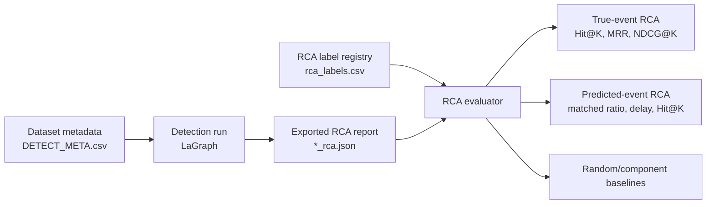

# RCA Evaluation Protocol

This document fixes the current experimental boundary for LaGraph's paper
direction. The goal is to avoid mixing pure anomaly detection benchmarks with
datasets that can support root-cause analysis (RCA).

## Dataset Roles

| Dataset | Current role | RCA status | Decision |
|---|---|---|---|
| HAI 21.03 test1-test5 | Main industrial RCA benchmark | Registered subsystem labels from `attack_P1/P2/P3` | Use for detection, predicted-event RCA, and graph faithfulness |
| SWaT | Industrial validation | Attack-stage/tag mapping still missing | Keep detection; add RCA only after source labels are registered |
| TE-MM | Process fault generalization | Fault-file to IDV mapping needs confirmation | Keep detection; add process-unit RCA only after mapping is verified |
| WADI | Future industrial validation | Not downloaded yet | Add after official WaDi.A2 data and attack labels are available |
| MSL | Removed from active suite | Weak RCA ground truth for this paper's claim | Do not use in main experiments |
| SMD | Removed from active suite | Large and not aligned with current industrial RCA story | Do not use in main experiments |

## Unified Label Registry

The canonical RCA label file is:

```text
D:\la_v12\dataset\anomaly_detect\rca_labels.csv
```

Schema:

```text
dataset,file,event_id,event_start,event_end,subsystem_root,variable_roots,granularity,task,time_index,source
```

Only labels with an inspectable source should enter this file. Unsupported
datasets should remain absent rather than being assigned guessed roots.

## Evaluation Flow



## Current Strict Claim Boundary

The current defensible claim is:

```text
LaGraph provides competitive industrial anomaly detection and reliable
subsystem-level RCA on datasets with verified event-level root-cause labels.
```

The current claim should not be:

```text
LaGraph is a universal RCA method for all anomaly detection datasets.
```

## Open Labeling Risks

TE-MM needs special handling. Its README states that `m(1-6)d01-28` correspond
to `IDV(28)-(01)`, so file number and disturbance ID may be reversed. Until this
is verified from the generation code or source documentation, TE-MM RCA labels
must not be treated as ground truth.

SWaT needs attack-to-stage or attack-to-tag mapping from the official attack
list. Detection labels alone are insufficient for RCA metrics.

## Commands

Build the registry from curated metadata:

```powershell
D:\Anaconda3\envs\lagraph5070\python.exe D:\la_v12\scripts\build_rca_label_registry.py
```

Validate coverage and event bounds:

```powershell
D:\Anaconda3\envs\lagraph5070\python.exe D:\la_v12\scripts\validate_rca_registry.py
```

Evaluate an exported RCA report with the registry:

```powershell
D:\Anaconda3\envs\lagraph5070\python.exe D:\la_v12\scripts\evaluate_rca.py --rca D:\la_v12\result\rca\HAI_21_03_test2\20260526_224746_rca.json --event-source predicted --prediction-key 1.0 --scope group
```
