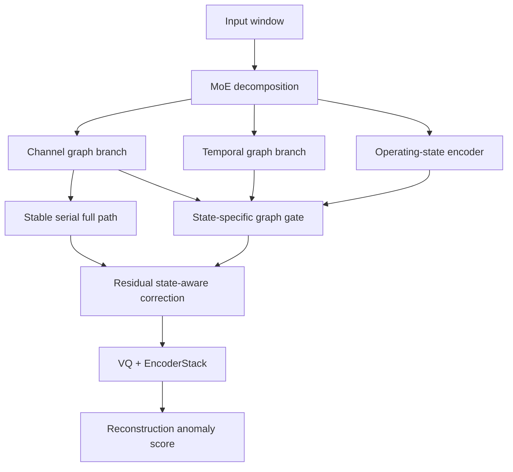

# State-aware LaGraph research plan

_Date: 2026-05-25. Branch: `codex/5070-env-migration`._

---

## Direction

The next architecture direction is **state-aware structural generalization for
industrial multivariate time-series anomaly detection**.

The motivation is that the existing dual-graph architecture is stable, but the
current evidence does not prove that a fixed serial channel graph + temporal
graph is always better than single-graph variants. For an industrial paper, the
stronger claim is:

> Different operating states require different reliance on channel dependency
> and temporal dynamics. A detector should adapt graph fusion to the current
> state rather than use a fixed graph order.

## Implemented profiles

Three new profiles were added to `ts_benchmark/run_single.py`.

| Profile | Purpose | Main changes |
| --- | --- | --- |
| `state-aware` | primary candidate | fixed temporal graph + state-aware residual correction over the serial path |
| `state-aware-dynamic` | dynamic temporal candidate | `state-aware` plus content-adaptive temporal graph |
| `state-aware-causal` | RCA-oriented candidate | `state-aware` plus lagged counterfactual parent-hurt score |

## Architecture



The implemented module is `StateAwareGraphFusion` in:

```text
ts_benchmark/baselines/self_impl/LaGraph/gcn_model.py
```

It computes window-level operating-state probabilities from four statistics:

```text
mean, standard deviation, first-last slope, absolute energy
```

Then it learns state-specific graph gates:

```text
parallel = gate(state) * channel_branch
         + (1 - gate(state)) * temporal_branch

output = serial_full_path
       + residual_weight * (parallel - serial_full_path)
```

This keeps the stable `full` pathway as the anchor while allowing the model to
learn state-dependent corrections.

## Regularization

Two optional unsupervised state regularizers were added:

| Term | Config | Meaning |
| --- | --- | --- |
| state balance | `lambda_state_balance` | prevents all windows from collapsing into one latent state |
| state confidence | `lambda_state_confidence` | encourages clearer state assignments |

The default state-aware profile uses small weights:

```text
lambda_state_balance = 0.001
lambda_state_confidence = 0.001
```

## Verification

Completed checks:

| Check | Result |
| --- | --- |
| `py_compile` for runner and model files | passed |
| CLI help includes new profiles and arguments | passed |
| 1-epoch MSL smoke test for `state-aware` | passed |
| tensor forward test for `state-aware`, `state-aware-dynamic`, `state-aware-causal` | passed |

The smoke test is not a performance result. It only verifies that training,
thresholding, and inference can run through the new path.

## First experiment plan

Run the following after this implementation.

Primary comparison:

```powershell
D:\Anaconda3\envs\lagraph5070\python.exe ts_benchmark/run_single.py --epochs 15 --datasets MSL.csv swat.csv --arch-profile full --num-workers 2 --prefetch-factor 2 --save-dir label/LaGraph_main_15ep
D:\Anaconda3\envs\lagraph5070\python.exe ts_benchmark/run_single.py --epochs 15 --datasets MSL.csv swat.csv --arch-profile state-aware --num-workers 2 --prefetch-factor 2 --save-dir label/LaGraph_state_aware_15ep
```

Candidate comparison:

```powershell
D:\Anaconda3\envs\lagraph5070\python.exe ts_benchmark/run_single.py --epochs 15 --datasets MSL.csv swat.csv --arch-profile state-aware-dynamic --num-workers 2 --prefetch-factor 2 --save-dir label/LaGraph_state_aware_dynamic_15ep
D:\Anaconda3\envs\lagraph5070\python.exe ts_benchmark/run_single.py --epochs 15 --datasets MSL.csv swat.csv --arch-profile state-aware-causal --num-workers 2 --prefetch-factor 2 --save-dir label/LaGraph_state_aware_causal_15ep
```

Sensitivity checks:

```powershell
D:\Anaconda3\envs\lagraph5070\python.exe ts_benchmark/run_single.py --epochs 15 --datasets MSL.csv swat.csv --arch-profile state-aware --state-aware-residual-init 0.05 --num-workers 2 --prefetch-factor 2 --save-dir label/LaGraph_state_aware_res005
D:\Anaconda3\envs\lagraph5070\python.exe ts_benchmark/run_single.py --epochs 15 --datasets MSL.csv swat.csv --arch-profile state-aware --state-aware-residual-init 0.30 --num-workers 2 --prefetch-factor 2 --save-dir label/LaGraph_state_aware_res030
D:\Anaconda3\envs\lagraph5070\python.exe ts_benchmark/run_single.py --epochs 15 --datasets MSL.csv swat.csv --arch-profile state-aware --state-aware-num-states 3 --num-workers 2 --prefetch-factor 2 --save-dir label/LaGraph_state_aware_k3
D:\Anaconda3\envs\lagraph5070\python.exe ts_benchmark/run_single.py --epochs 15 --datasets MSL.csv swat.csv --arch-profile state-aware --state-aware-num-states 6 --num-workers 2 --prefetch-factor 2 --save-dir label/LaGraph_state_aware_k6
```

## Decision rule

Promote `state-aware` only if it satisfies at least one of the following:

| Condition | Required evidence |
| --- | --- |
| balanced improvement | improves mean affiliation F1 without large raw/adjusted loss on MSL and SWaT |
| industrial story improvement | similar metrics to `full`, but clearer ablation and state-gate interpretability |
| RCA bridge | `state-aware-causal` improves affiliation or root-cause-style channel ranking without severe adjusted-F1 loss |

If it fails, keep it as a negative ablation showing that state conditioning alone
is not enough without explicit operating-state labels or cross-condition data.

## Paper framing

If the results are positive, the contribution should be framed as:

> A state-aware dual-graph detector that adapts the use of channel dependency
> and temporal dynamics to latent operating conditions, improving industrial
> structural generalization and providing a bridge to root-cause localization.

This is stronger than claiming "dual graph is new", because feature/temporal
dual-graph methods already exist.

