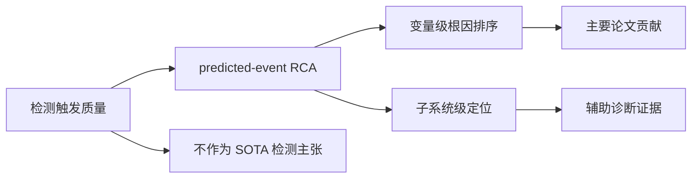

# LaGraph 实验结果水平与投稿定位报告

检索日期：2026-06-07  
项目路径：`D:\la_v12`  
本地依据：`D:\la_v12\result\analysis\architecture_experiment_summary.md`、`D:\la_v12\docs\MANUSCRIPT_DRAFT_ZH_2026_06_07.md`

## 1. 一句话结论

当前结果不适合按“通用多变量时间序列异常检测 SOTA”投稿，因为 WADI/SWaT 的 raw F1 明显弱于常见检测论文；但它适合作为“工业异常诊断 / predicted-event RCA / 源头变量排序”的论文来推进。最强证据是变量级 RCA：在 WADI 上 MRR 0.5960、Hit@1 0.5000，在 SWaT 上 MRR 0.5087、Hit@1 0.3939，均明显超过随机、z-score 和静态相关图基线。

如果补齐消融、稳定性和案例图，现实目标建议优先放在 `EAAI / ESWA / KBS / Neurocomputing` 这类应用 AI 或智能系统期刊；`IEEE TII / IEEE TASE / Information Sciences / RESS` 可以作为加强后的 stretch target。KDD/ICLR/NeurIPS 主会现在不建议直接冲，除非后续把方法贡献和标准化检测/RCA 对比大幅补强。

## 2. 当前结果的证据分层

### 2.1 检测指标：可支撑事件触发，不支撑检测 SOTA

| 数据集 | 主线设置 | Best Affiliation F1 | Raw F1 at best Aff | Adjusted F1 at best Aff | 判断 |
|---|---:|---:|---:|---:|---|
| WADI | source-bottleneck-specificity, 8 epoch | 0.7569 | 0.0975 | 0.1521 | raw/adjusted 弱，只能说事件级触发尚可 |
| WADI | source-bottleneck-specificity, 15 epoch | 0.7695 | 0.1063 | 0.1528 | 检测略好，但变量级 MRR 略降 |
| SWaT | source-bottleneck-specificity, 8 epoch | 0.7866 | 0.1819 | 0.8349 | adjusted 好，raw 仍弱 |

外部检测论文通常报告 point-level 或 point-adjusted F1，协议不完全一致，但数量级上能看出风险。例如 GDN 在原论文中报告 SWaT F1 0.81、WADI F1 0.57；TranAD 的 PVLDB 表格在完整训练数据下报告 SWaT F1 0.8151、WADI F1 0.4951。相比之下，本项目 WADI raw F1 约 0.10，SWaT raw F1 约 0.18，因此不能把检测作为主贡献。

同时，时间序列异常检测领域已有明确的评价风险提醒：AAAI 2022 的严格评估论文指出 point adjustment 可能显著高估检测性能，甚至使随机异常分数看起来很强；KDD 2022 的 affiliation metrics 工作也强调事件区间评价需要避免被宽松区间指标操纵。因此正式稿中应该同时报告 raw F1、adjusted F1、Affiliation Precision/Recall/F1，并把检测定位为 RCA 链条的必要前置步骤。

### 2.2 变量级 RCA：当前最强、最值得写的结果

| 数据集 | 方法 | Matched | MRR | Hit@1 | Hit@3 | Hit@5 | 评价 |
|---|---:|---:|---:|---:|---:|---:|---|
| WADI | z-score baseline | 待补 | 0.1934 | 0.0714 | 0.1429 | 0.4286 | 简单统计偏离很弱 |
| WADI | random baseline | 待补 | 0.2917 | 0.1186 | 0.3103 | 0.4816 | 随机排序也不低，说明事件标签/候选集有结构 |
| WADI | soft-hierarchical-rca | 1.0000 | 0.4507 | 0.3571 | 0.5000 | 0.5714 | 早期层级基线 |
| WADI | source-bottleneck-balanced | 1.0000 | 0.5268 | 0.3571 | 0.6429 | 0.7143 | 源瓶颈有效 |
| WADI | source-bottleneck-specificity | 1.0000 | 0.5960 | 0.5000 | 0.7143 | 0.7143 | 当前主结果 |
| SWaT | random channel mean | 0.9394 | 0.1066 | 0.0271 | 0.0795 | 0.1338 | 1000 次随机均值 |
| SWaT | random graph prior | 0.9394 | 0.2731 | 0.1212 | 0.3030 | 0.3636 | 随机图传播统计证据 |
| SWaT | z-score baseline | 0.9394 | 0.3201 | 0.1515 | 0.4242 | 0.4848 | 简单统计偏离 |
| SWaT | correlation prior | 0.9394 | 0.2550 | 0.1212 | 0.2727 | 0.2727 | 静态相关图 |
| SWaT | source-bottleneck-specificity | 0.9394 | 0.5087 | 0.3939 | 0.5758 | 0.6667 | 当前主结果 |

这部分可以评价为 `B / B+`：不是顶会级压倒性 SOTA，但已经有清楚的相对提升，尤其是在变量级 root cause ranking 而不是粗粒度区域定位上。正式稿应避免说“检测最优”，应说“在 predicted-event 条件下，方法能把诊断从最大偏差变量推进到更像事件源头的变量排序”。

### 2.3 子系统级 RCA：好看，但不能单独当主贡献

| 数据集 | 方法 | Matched | Subsystem MRR | Hit@1 | Hit@3 | Hit@5 | 评价 |
|---|---:|---:|---:|---:|---:|---:|---|
| WADI | z-score baseline | 待补 | 0.7679 | 0.5714 | 0.9286 | 1.0000 | 粗粒度统计基线已经很强 |
| WADI | source-bottleneck-specificity | 待补 | 0.7917 | 0.6429 | 0.9286 | 1.0000 | 有提升但幅度不大 |
| SWaT | z-score baseline | 0.9118 | 0.5296 | 0.3235 | 0.6765 | 0.7941 | 中等强度基线 |
| SWaT | source-bottleneck-specificity | 0.9394 | 0.8102 | 0.7097 | 0.9032 | 0.9677 | 明显更强 |
| HAI | mechanism-root-sharp-rca | 1.0000 | 0.9111 | 0.8367 | 1.0000 | 1.0000 | 粗粒度补充证据 |

子系统级结果可以作为“层级诊断可读性”的证据，但不宜单独主打。原因是 WADI 的 z-score 子系统 MRR 已经达到 0.7679，说明粗粒度定位部分可以被简单统计方法解决；论文应把重心放在变量级根因排序和源/传播区分。

## 3. 与代表性工作的相对位置

| 方向 | 代表工作/来源 | 外部结果或结论 | 对本项目的含义 |
|---|---|---|---|
| 图异常检测 | GDN, AAAI 2021 | GDN 原文报告 SWaT F1 0.81、WADI F1 0.57 | 检测 raw F1 不是我们的强项 |
| Transformer 检测/诊断 | TranAD, PVLDB 2022 | 完整训练下 SWaT F1 0.8151、WADI F1 0.4951；诊断表主要给 SMD/MSDS HitRate/NDCG | 可引用其“检测+诊断”定位，但我们的 SWaT/WADI 变量 RCA 协议更细 |
| Transformer TSAD | Anomaly Transformer, ICLR 2022 Spotlight | 主张 association discrepancy 并在多个 TSAD 基准上达到强检测结果 | 若投 ML/DM 顶会，需要同级别方法 novelty 和标准检测对比 |
| 评价协议 | Towards a Rigorous Evaluation, AAAI 2022 | point adjustment 可能高估检测性能 | 论文必须谨慎使用 adjusted F1 |
| 事件评价 | Affiliation metrics, KDD 2022 | 提供局部、可解释、参数少的事件区间评价 | 本项目使用 Affiliation F1 是合理方向，但不能单独替代 raw 指标 |

总体位置：

- 异常检测任务：`C- / D+`。当前不具备检测 SOTA 竞争力。
- 事件级触发任务：`B-`。Affiliation F1 0.75-0.79 说明 predicted-event RCA 有可用入口，但还需要 precision/recall 分解和阈值稳定性。
- 变量级 RCA：`B / B+`。这是主贡献所在；相对简单基线有实质提升。
- 子系统级 RCA：`B+`，但证据独立性不足，因为粗粒度统计基线已强。
- 可解释性/机制性：`B-`。方向清楚，但还缺 seed 稳定性、组件消融、案例图和反例分析。

## 4. 投稿期刊/会议分层建议

### 4.1 最现实的第一梯队目标

| 目标 | 匹配度 | 当前可投性 | 需要强化点 | 建议定位 |
|---|---:|---:|---|---|
| Engineering Applications of Artificial Intelligence | 高 | 中高 | 明确 AI contribution + engineering application；补 case study | 工业异常诊断中的源瓶颈图学习 |
| Expert Systems with Applications | 高 | 中高 | 强调智能诊断系统、决策支持、可解释 RCA | 工业智能系统的异常根因排序 |
| Knowledge-Based Systems | 中高 | 中 | 需要把 source/propagation 知识结构讲清楚 | 知识增强/结构化诊断模型 |
| Neurocomputing | 中高 | 中 | 补充神经网络结构与消融，降低工业系统叙事比重 | 图神经网络/时序神经诊断方法 |

这些期刊更接受“方法 + 公共数据 + 实际应用问题”的组合。当前最适合的是 EAAI/ESWA，因为它们更重视工程应用、智能诊断和可复现实验，不一定要求在所有检测指标上达到顶级 SOTA。

### 4.2 加强后可以尝试的 stretch targets

| 目标 | 匹配度 | 当前风险 | 需要达到的最低补强 |
|---|---:|---|---|
| IEEE Transactions on Industrial Informatics | 高 | 难度高；需要强工业信息学贡献 | 多数据集稳定性、完整 ablation、工业控制/IIoT 价值、检测与诊断链条都要稳 |
| IEEE Transactions on Automation Science and Engineering | 中高 | 需要更强 automation/decision-support 叙事 | 诊断如何改善运维决策、自动化系统可靠性、案例闭环 |
| Information Sciences | 中 | 方法创新要求更高 | 结构化学习理论或泛化性证据更强 |
| Reliability Engineering & System Safety | 中 | 如果只讲 AI 方法会偏题 | 强调安全可靠性、故障诊断、事故/风险管理意义 |
| Computers & Security | 中 | 需要网络安全/ICS 攻击语境更强 | 把 SWaT/WADI/HAI 攻击场景、攻击根因、响应时间讲成主线 |

### 4.3 会议建议

| 会议/轨道 | 当前建议 | 原因 |
|---|---|---|
| KDD Research Track | 暂不建议 | 需要更强算法创新和标准 benchmark SOTA；当前检测指标弱 |
| KDD Applied Data Science / workshop | 可作为长线尝试 | 若强调工业诊断系统、评价协议和 RCA 实用价值，有机会 |
| ICDM / CIKM / PAKDD / ECML PKDD | 可考虑 applied/workshop 或后续加强版主会 | 与数据挖掘、知识发现、时序诊断较匹配，但需要更规范外部基线 |
| AAAI / IJCAI | 暂不作为首选 | 除非把 source-bottleneck/specificity 变成更清晰的通用 AI 方法 |
| ICLR / NeurIPS / ICML | 不建议当前版本 | 需要基础方法创新、理论或强通用实验，当前更像应用诊断论文 |

注意：搜索时出现了一些名称类似 “ICDM 2026” 但不是 IEEE International Conference on Data Mining 的页面，应避免误投。若考虑 ICDM，应以 IEEE ICDM 官方页面或历史 CFP 为准。

## 5. 正式投稿前必须补的实验

1. 检测完整表：raw precision/recall/F1、adjusted precision/recall/F1、Affiliation P/R/F1、AUROC、AUPRC、阈值协议。
2. 变量级 RCA 消融：no source gate、no bottleneck、no onset evidence、no propagation suppression、no event-specificity、residual-only、graph-only。
3. 稳定性：至少 3 个 seed；WADI 8/15 epoch 的选择要解释为“变量 RCA 最优”和“检测更优”的权衡。
4. 外部强基线：z-score、correlation graph、random graph 已有；建议再加 occlusion/gradient/SHAP-style attribution、residual ranking、Granger/causal baseline 或 graph-centrality+residual。
5. 案例图：至少 3 个事件，包括成功、近失误、失败。图中要展示真实根因、top-k 排名、通用响应变量被 specificity 降权、预测事件边界。
6. 统计显著性：对 Hit@1/MRR 做 bootstrap CI 或 paired permutation test，避免只给单点值。
7. 数据集说明：SWaT/WADI/HAI 标签粒度不同，不能把 HAI 粗粒度结果混入变量级主表。

## 6. 推荐论文主张

建议主张：

> 本文提出一种面向工业多变量时序的 predicted-event root-cause ranking 框架。该框架将异常检测事件作为诊断入口，通过 source-bottleneck evidence、机制图信息、onset evidence 和 event-specificity suppression 抑制跨事件通用响应变量，从而提升变量级根因排序。

不建议主张：

- “通用异常检测 SOTA”
- “因果发现模型”
- “完全可解释/可证明的根因定位”
- “在所有工业数据集上泛化”
- “Nature/Science 级重大科学发现”

## 7. 最终投稿路线

短期最稳路线：

1. 先把中文稿转为完整英文初稿，目标锁定 `EAAI` 或 `ESWA`。
2. 同步补 RCA 消融、稳定性、案例图。
3. 若补强后检测表仍弱，则继续把 detection 写成 “event trigger”，不要与 GDN/TranAD/Anomaly Transformer 正面比检测 SOTA。
4. 如果补强后变量 RCA 有显著 seed 稳定性，并且案例解释很强，再考虑 `KBS / Neurocomputing / Information Sciences`。
5. 如果能把工业控制系统安全、故障诊断闭环和可靠性价值讲清楚，再冲 `IEEE TII / TASE / RESS / Computers & Security`。

我的当前排序：

| 排名 | 目标 | 理由 |
|---:|---|---|
| 1 | Engineering Applications of Artificial Intelligence | scope 最匹配：AI + 真实工程应用 + fault diagnosis/monitoring |
| 2 | Expert Systems with Applications | 智能诊断系统和决策支持叙事匹配 |
| 3 | Knowledge-Based Systems | 若强化机制知识和 source/propagation 表征，可投 |
| 4 | Neurocomputing | 若强调神经结构和消融，可投 |
| 5 | Computers & Security | 若重构为 ICS attack diagnosis 论文，可投 |
| 6 | IEEE TII / TASE | 加强后的 stretch target |

## 8. 参考来源

- GDN, AAAI 2021: [Graph Neural Network-Based Anomaly Detection in Multivariate Time Series](https://cdn.aaai.org/ojs/16523/16523-13-20017-1-2-20210518.pdf)
- TranAD, PVLDB 2022: [TranAD: Deep Transformer Networks for Anomaly Detection in Multivariate Time Series Data](https://vldb.org/pvldb/vol15/p1201-tuli.pdf)
- MTAD-GAT: [Multivariate Time-Series Anomaly Detection via Graph Attention Network](https://arxiv.org/abs/2009.02040)
- Anomaly Transformer, ICLR 2022: [OpenReview page](https://openreview.net/forum?id=LzQQ89U1qm_)
- Point-adjustment critique, AAAI 2022: [Towards a Rigorous Evaluation of Time-Series Anomaly Detection](https://ojs.aaai.org/index.php/AAAI/article/view/20680)
- Affiliation metrics, KDD 2022: [Local Evaluation of Time Series Anomaly Detection Algorithms](https://arxiv.org/abs/2206.13167), [implementation](https://github.com/ahstat/affiliation-metrics-py)
- SWaT/WADI datasets: [iTrust datasets](https://www.sutd.edu.sg/itrust/itrust-labs/datasets/), [WADI dataset info](https://itrust.sutd.edu.sg/itrust-labs_datasets/dataset_info/)
- HAI dataset: [HIL-based Augmented ICS Security Dataset](https://github.com/icsdataset/hai)
- IEEE TII scope: [IEEE Transactions on Industrial Informatics](https://www.ieee-ies.org/pubs/transactions-on-industrial-informatics)
- EAAI scope: [Engineering Applications of Artificial Intelligence](https://shop.elsevier.com/journals/engineering-applications-of-artificial-intelligence/0952-1976)
- ESWA scope: [Expert Systems with Applications](https://shop.elsevier.com/journals/expert-systems-with-applications/0957-4174)
- KBS scope: [Knowledge-Based Systems](https://shop.elsevier.com/journals/knowledge-based-systems/0950-7051)
- Neurocomputing scope: [Neurocomputing](https://shop.elsevier.com/journals/neurocomputing/0925-2312)
- RESS scope: [Reliability Engineering & System Safety](https://shop.elsevier.com/journals/reliability-engineering-and-system-safety/0951-8320)
- KDD 2026 Research Track: [Call for Papers](https://kdd2026.kdd.org/research-track-call-for-papers/)
- CIKM scope: [ACM SIGWEB CIKM](https://www.sigweb.sigweb.hosting.acm.org/conferences/acm-sigweb-conferences/cikm)
- PAKDD 2026: [conference site](https://www.pakdd2026.org/)
- IEEE ICDM scope reference: [ICDM 2024 Call for Papers](https://icdm2024.org/call_for_papers)
