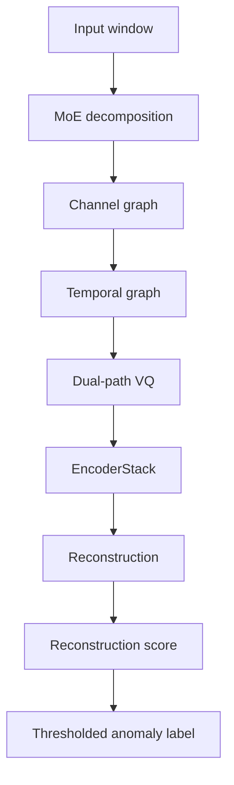
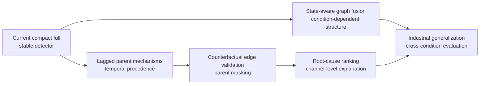

# LaGraph weekly progress summary

_Period: 2026-05-19 to 2026-05-25. Purpose: group-meeting PPT source material._

---

## Executive summary

This week focused on moving LaGraph from the original multi-GPU research code
into a reproducible RTX 5070 single-GPU experimental pipeline, then using that
pipeline to test whether the current architecture can be simplified or improved.

The main conclusion is:

> The current compact `full` profile is stable and usable as the main baseline,
> but the evidence does not support claiming that every module improves every
> metric. The paper should move away from "module stacking" and toward a clearer
> industrial story: efficient dual-graph representation, event-level anomaly
> detection, interpretable channel dependency, and future state-aware or causal
> root-cause diagnosis.

Key outcomes:

- The RTX 5070 environment and single-GPU runner are now usable.
- DDP has been disabled in the main experimental path.
- Dead or unsupported modules were removed from the main architecture.
- `full` is the safest current profile; `dynamic-temporal-gated`,
  `causal-cf-hurt`, `synthetic-aux`, and `loss-logcosh` are candidates, not
  final replacements.
- Simple event post-processing, score smoothing, graph fusion variants, and VQ
  score fusion did not produce robust improvements.
- The most valuable next research direction is not another generic block, but
  state-aware/cross-condition industrial generalization or causal root-cause
  localization.

## Work timeline

```mermaid
flowchart LR
    accTitle: Weekly Work Timeline
    accDescr: The week moved from environment migration to architecture cleanup, experiment search, and research positioning.

    env["5070 environment<br/>conda + PyTorch CUDA"]
    git["Git management<br/>local branch + remote configured"]
    single["Single-GPU migration<br/>DDP disabled"]
    simplify["Architecture cleanup<br/>remove dead modules"]
    experiments["Ablation search<br/>graphs, VQ, loss, scoring"]
    paper["Paper positioning<br/>industrial generalization + RCA"]
    next["Next phase<br/>state-aware or causal module"]

    env --> git --> single --> simplify --> experiments --> paper --> next
```



## Engineering work completed

### Environment migration

The project now has a dedicated RTX 5070 environment file:

```text
environment_5070.yml
```

Main resolved environment:

| Item | Current setting |
| --- | --- |
| Conda env | `lagraph5070` |
| Python | `3.10` |
| PyTorch | `2.7.0+cu128` |
| torchvision | `0.22.0+cu128` |
| torchaudio | `2.7.0+cu128` |
| Key fix | `dash==2.18.2` requires `Flask<3.1`, so Flask was set to `3.0.3` |

The current experimental command should use:

```powershell
D:\Anaconda3\envs\lagraph5070\python.exe ts_benchmark/run_single.py --epochs 15 --arch-profile full --num-workers 2 --prefetch-factor 2
```

### Git and reproducibility

Current local branch:

```text
codex/5070-env-migration
```

Remote is configured:

```text
origin https://github.com/sunyujie0730-bot/lagraph.git
```

Important policy:

- Use local Git commits for backup and rollback.
- Do not push to GitHub unless explicitly requested.
- Keep generated logs untracked unless they are selected for reporting.

Latest local commit before this weekly summary:

```text
abfdcee Add event-affiliation scoring profiles
```

### Single-GPU training path

The original code supported an eight-card/DDP workflow. This week the main
experiment path was migrated to single GPU:

- `--n-gpus > 1` is now downgraded to single GPU with a clear message.
- DDP is removed from the active RTX 5070 path.
- The runner exposes `--num-workers` and `--prefetch-factor`.
- Default data-loading setting is now:

```text
num_workers = 2
prefetch_factor = 2
```

Batch size was intentionally not increased because previous tests suggested
batch-size changes can affect experimental results. The current optimization
therefore improves input throughput without changing the statistical training
setting.

## Current architecture status

### Main compact architecture

The main profile remains:

```text
--arch-profile full
```

But its meaning has changed. It is now the compact final architecture, not an
all-module stacked version.

Retained modules:

| Module | Role |
| --- | --- |
| MoE decomposition | separates trend/residual information |
| Channel graph | models cross-variable dependency |
| Temporal graph | models temporal refinement |
| Dual-path VQ | training-side normal-pattern regularization |
| EncoderStack | multi-scale temporal representation |
| Direct reconstruction score | main anomaly scoring path |

Removed or downgraded modules:

| Module | Current decision |
| --- | --- |
| BoundaryDetector | removed from main architecture |
| multi-scale/VQ anomaly scorer | ablation only |
| prediction head switches | removed as dead switches |
| contrastive/frequency/prototype switches | removed as dead switches |
| direct VQ score fusion | rejected after tests |

### Current system flow



## Experimental results

### Stable `full` baseline

Three-seed check, 15 epochs, MSL and SWaT:

| Dataset | Raw F1 mean | Adjusted F1 mean | Affiliation F1 mean | Interpretation |
| --- | ---: | ---: | ---: | --- |
| MSL | 0.1078 | 0.8561 | 0.6980 | stable but raw point-wise F1 is weak |
| SWaT | 0.3138 | 0.9296 | 0.8441 | stable and strong event-level behavior |

Conclusion:

- `full` is stable enough for future baseline comparisons.
- The main weakness is raw point-wise F1, not seed instability.
- The paper can emphasize event-level and affiliation metrics, but raw F1 must
  still be reported transparently.

### Single-graph ablation

Seed 2021, 15 epochs:

| Profile | Dataset | Raw F1 | Adjusted F1 | Affiliation F1 | Conclusion |
| --- | --- | ---: | ---: | ---: | --- |
| `full` | MSL | 0.1109 | 0.8576 | 0.7006 | main baseline |
| `channel-only` | MSL | 0.1162 | 0.8584 | 0.6936 | better raw/adjusted, lower affiliation |
| `temporal-only` | MSL | 0.1106 | 0.8580 | 0.6996 | almost same as full |
| `full` | SWaT | 0.3169 | 0.9361 | 0.8458 | main baseline |
| `channel-only` | SWaT | 0.3510 | 0.9216 | 0.8594 | better raw/affiliation, lower adjusted |
| `temporal-only` | SWaT | 0.3144 | 0.9360 | 0.8439 | almost same as full |

Strict interpretation:

- Current dual-graph evidence is not strong enough to claim universal
  superiority over single-graph variants.
- `channel-only` is surprisingly competitive, especially on SWaT.
- `temporal-only` being close to `full` means the current dual-graph fusion may
  contain redundancy.

### Dynamic temporal graph

Three-seed check:

| Profile | Dataset | Raw F1 mean | Adjusted F1 mean | Affiliation F1 mean | Interpretation |
| --- | --- | ---: | ---: | ---: | --- |
| `full` | MSL | 0.1078 | 0.8561 | 0.6980 | stable baseline |
| `dynamic-temporal-gated` | MSL | 0.1158 | 0.8559 | 0.6934 | better raw, worse affiliation |
| `full` | SWaT | 0.3138 | 0.9296 | 0.8441 | stable baseline |
| `dynamic-temporal-gated` | SWaT | 0.3417 | 0.9187 | 0.8528 | better raw/affiliation, worse adjusted |

Conclusion:

- `dynamic-temporal-gated` is useful but dataset-dependent.
- It should be reported as an adaptive-temporal candidate, not promoted as the
  default architecture yet.
- The claim should be tradeoff-aware: adaptive temporal graphing can improve
  point-wise ranking and SWaT event coverage, but it does not dominate `full`.

### Rejected architecture variants

Several architecture ideas were tested and rejected as main modules:

| Category | Tested idea | Result |
| --- | --- | --- |
| Parallel dual graph | `parallel-dual`, `parallel-dual-time` | raw F1 may improve, affiliation drops |
| Residual dual graph | `residual-dual`, `residual-dual-time` | no meaningful gain |
| Graph-shift scoring | deviation from normal channel graph | interpretable but not better |
| VQ score fusion | direct VQ anomaly score | weak or harmful |
| Dynamic graph regularization | temporal smoothness/locality penalty | worsened MSL affiliation |
| Channel-normalized scoring | robust channel normalization | no reliable gain |

Main lesson:

> The problem is not solved by simply adding another graph branch or score term.
> The current objective has no direct signal teaching the model when to trust
> channel structure versus temporal structure.

### Loss-function search

Seed 2021, 15 epochs:

| Profile | Dataset | Raw F1 | Adjusted F1 | Affiliation F1 | Decision |
| --- | --- | ---: | ---: | ---: | --- |
| `full` | MSL | 0.1109 | 0.8576 | 0.7006 | MSE baseline |
| `loss-logcosh` | MSL | 0.1097 | 0.8573 | 0.7059 | best MSL affiliation candidate |
| `loss-smoothl1` | MSL | 0.1090 | 0.8572 | 0.7052 | positive MSL candidate |
| `loss-mse-mae` | MSL | 0.1114 | 0.8575 | 0.7017 | too small |
| `loss-diff` | MSL | 0.1104 | 0.8579 | 0.6994 | reject |
| `full` | SWaT | 0.3169 | 0.9361 | 0.8458 | MSE baseline |
| `loss-logcosh` | SWaT | 0.2800 | 0.9269 | 0.8168 | reject as default |
| `loss-smoothl1` | SWaT | 0.2810 | 0.9257 | 0.8172 | reject as default |

Conclusion:

- MSE remains the default.
- `log_cosh` improves MSL affiliation but degrades SWaT, so it is not a general
  replacement.
- Robust losses are useful as sensitivity analysis, especially for datasets
  with contaminated normal data.

### Event-affiliation optimization

The following strategies were tested:

- score smoothing;
- gap filling;
- minimum predicted segment length;
- dilation;
- event-persistence score amplification;
- top-k channel aggregation changes.

Representative result on MSL:

| Setting | Raw F1 | Adjusted F1 | Affiliation F1 | Decision |
| --- | ---: | ---: | ---: | --- |
| `full` | 0.1109 | 0.8576 | 0.7006 | baseline |
| `loss-logcosh` | 0.1097 | 0.8573 | 0.7059 | positive MSL-only candidate |
| `full-event-affinity-lite` | 0.1106 | 0.6991 | 0.6804 | reject |
| smoothing + gap fill + min length | 0.1123 | 0.6639 | 0.6876 | reject |
| `full-event-persistence` | 0.1104 | 0.8586 | 0.6956 | reject |
| `--score-topk-k 3` | 0.1085 | 0.8575 | 0.7005 | no gain |
| `--score-topk-k 8` | 0.1108 | 0.8578 | 0.6972 | reject |

Conclusion:

> Naive post-processing does not produce a defensible affiliation gain. It often
> expands predicted events but damages event precision. Future affiliation
> improvements should come from representation learning, training objectives, or
> calibrated thresholding, not from simple segment inflation.

### Causal and synthetic auxiliary candidates

Two exploratory directions showed small positive signals:

| Profile | Main idea | Raw F1 | Adjusted F1 | Affiliation F1 | Decision |
| --- | --- | ---: | ---: | ---: | --- |
| `causal-lag-score` | lagged parent mechanism residual | 0.1102 | 0.8574 | 0.6983 | reject as main |
| `causal-cf-hurt` | counterfactual parent-hurt score | 0.1109 | 0.7987 | 0.7024 | candidate, small gain |
| `synthetic-aux` | synthetic industrial perturbation auxiliary head | 0.1113 | 0.8576 | 0.7023 | candidate, small gain |

Conclusion:

- The first causal implementation is useful as a prototype, but not strong
  enough as a final contribution.
- Counterfactual parent-hurt scoring is the first causal-style variant with a
  positive MSL affiliation signal, but the gain is small.
- Synthetic industrial perturbations are promising, but need multi-seed and
  SWaT validation.

## Research-positioning conclusions

### What should not be claimed

The current evidence does not support these claims:

- "Every module improves performance."
- "The dual graph is always better than a single graph."
- "VQ directly improves anomaly scoring."
- "Post-processing can safely trade point precision for affiliation F1."
- "The current learned channel graph is already causal."

### What can be claimed more safely

The current evidence supports these claims:

- A compact reconstruction-based dual-graph profile is stable on MSL and SWaT.
- Channel dependency modeling is important for industrial interpretability.
- Adaptive temporal graphing can improve some ranking/event metrics, especially
  on SWaT, but it has dataset-dependent tradeoffs.
- Negative ablations show that the final architecture is not arbitrary module
  stacking.
- Causal/root-cause functionality requires lagged mechanisms,
  counterfactual-style validation, or mechanism invariance before it can be
  described as causal inference.

### Relation to the LaGraph paper

The referenced LaGraph paper is best understood as a strong engineering
integration paper. Its strongest idea is not "using GNN" in general, but using a
Laplacian temporal proximity prior to regularize noisy temporal graph learning.

For our work, the differentiation should not be:

```text
LaGraph has a temporal graph; we add another graph.
```

The stronger differentiation is:

```text
LaGraph focuses on time-point graph learning. Our direction should focus on
industrial variable dependency, state-dependent structure change, and
root-cause-oriented channel interpretation.
```

### Similar-work risk

Several existing works already use feature/temporal graph combinations, such as
MTAD-GAT, MTS-GAT, MTAD-TCGA, and MST-GAT. This means the paper should not rely
on "dual graph" alone as the main novelty.

The more defensible paper direction is:

> State-adaptive structure generalization for industrial multivariate time-series
> anomaly detection.

or:

> Interpretable dual-graph anomaly detection with causal root-cause localization
> for industrial systems.

## Recommended PPT structure

Suggested slide sequence:

| Slide | Title | Main message |
| ---: | --- | --- |
| 1 | Research goal | From benchmark TSAD to industrial interpretable anomaly detection |
| 2 | This week's work | Environment, single-GPU migration, architecture cleanup, experiments |
| 3 | Engineering pipeline | RTX 5070 environment and reproducible runner |
| 4 | Current architecture | Compact `full` profile and removed modules |
| 5 | Stable baseline | `full` three-seed results on MSL/SWaT |
| 6 | Dual-graph ablation | current dual graph is useful but not universally superior |
| 7 | Dynamic temporal graph | improves some metrics, but has tradeoffs |
| 8 | Loss and scoring search | post-processing failed; `log_cosh` is MSL-only |
| 9 | Causal/RCA prototype | lagged and counterfactual ideas are feasible but preliminary |
| 10 | Literature pressure | dual graph alone is not enough novelty |
| 11 | Revised paper positioning | state-aware/cross-condition/causal industrial diagnosis |
| 12 | Next plan | validate candidates, add state-aware or RCA module, collect industrial data |

## Next work plan

### Short-term experiments

1. Keep `full` as the main baseline.
2. Keep `dynamic-temporal-gated` as the adaptive-temporal candidate.
3. Validate `synthetic-aux` on SWaT and additional seeds.
4. Validate `causal-cf-hurt` beyond MSL before using it in the paper.
5. Run key ablations with consistent `num_workers=2 --prefetch-factor=2`.

### Medium-term architecture direction

The highest-value direction is state-aware or causal structure learning:



Recommended priority:

| Priority | Direction | Reason |
| ---: | --- | --- |
| 1 | State-aware/cross-condition evaluation | strongest industrial-paper positioning |
| 2 | Root-cause ranking based on lagged channel mechanisms | differentiates from ordinary TSAD |
| 3 | Multi-dataset validation without SMD first | keeps runtime manageable |
| 4 | Parameter/runtimes/efficiency reporting | supports industrial deployment narrative |

### Suggested commands

Main baseline:

```powershell
D:\Anaconda3\envs\lagraph5070\python.exe ts_benchmark/run_single.py --epochs 15 --datasets MSL.csv swat.csv --arch-profile full --num-workers 2 --prefetch-factor 2 --save-dir label/LaGraph_main_15ep
```

Adaptive-temporal candidate:

```powershell
D:\Anaconda3\envs\lagraph5070\python.exe ts_benchmark/run_single.py --epochs 15 --datasets MSL.csv swat.csv --arch-profile dynamic-temporal-gated --num-workers 2 --prefetch-factor 2 --save-dir label/LaGraph_candidate_dynamic_temporal_gated_15ep
```

Key ablations:

```powershell
D:\Anaconda3\envs\lagraph5070\python.exe ts_benchmark/run_single.py --epochs 15 --arch-profile channel-only --num-workers 2 --prefetch-factor 2 --save-dir label/LaGraph_ablation_channel_only
D:\Anaconda3\envs\lagraph5070\python.exe ts_benchmark/run_single.py --epochs 15 --arch-profile temporal-only --num-workers 2 --prefetch-factor 2 --save-dir label/LaGraph_ablation_temporal_only
D:\Anaconda3\envs\lagraph5070\python.exe ts_benchmark/run_single.py --epochs 15 --arch-profile no-vq --num-workers 2 --prefetch-factor 2 --save-dir label/LaGraph_ablation_no_vq
```

Candidate checks:

```powershell
D:\Anaconda3\envs\lagraph5070\python.exe ts_benchmark/run_single.py --epochs 15 --datasets MSL.csv swat.csv --arch-profile synthetic-aux --num-workers 2 --prefetch-factor 2 --save-dir label/LaGraph_synthetic_aux_check
D:\Anaconda3\envs\lagraph5070\python.exe ts_benchmark/run_single.py --epochs 15 --datasets MSL.csv swat.csv --arch-profile causal-cf-hurt --num-workers 2 --prefetch-factor 2 --save-dir label/LaGraph_causal_cf_hurt_check
```

## Open risks

| Risk | Impact | Mitigation |
| --- | --- | --- |
| Dual graph is not consistently stronger than single graph | weakens architecture novelty | shift claim to state-aware structure generalization or RCA |
| Raw F1 remains weak | may hurt comparison against SOTA | report event metrics transparently and improve calibration/representation |
| Affiliation gains are small | hard to support "large improvement" claim | use affiliation as one part of story, not the only claim |
| Causal language is not yet fully justified | reviewer criticism risk | require lagged mechanisms, counterfactual tests, and RCA metrics |
| Public datasets may not reflect industrial deployment | external validity risk | add industrial/cross-condition datasets later |

## Final message for group meeting

The main progress this week was not a single large metric jump. The real progress
was making the system reproducible on RTX 5070, simplifying the architecture,
and identifying which claims are defensible. The current model is stable, but
ordinary dual-graph anomaly detection is not enough as a paper contribution.

The next version should be framed around one of the following:

1. state-aware cross-condition industrial anomaly detection;
2. causal/lagged root-cause localization;
3. efficient interpretable dual-graph detection for industrial deployment.

Among these, the strongest long-term direction is:

> state-aware dual-graph learning with causal root-cause diagnosis for industrial
> multivariate time-series anomaly detection.

